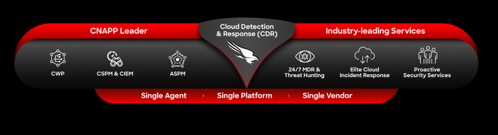

# CrowdStrike Cloud Workshops and Labs

Welcome to the CrowdStrike Cloud Workshops and Labs! The CrowdStrike Falcon platform offers a comprehensive CNAPP solution for protecting critical multi-cloud and cloud-native assets. It provides comprehensive visibility, threat detection and threat protection across your organization's hybrid, multi-cloud environment (AWS, Azure, GCP, Kubernetes, OpenShift). 

### Workshops
Please find the current list of workshops below:

* [CrowdStrike Falcon - AWS Cloud Protection](https://github.com/davidokeyode/crowdstrike-handson-workshops/tree/main/workshops/aws-cloud-protection)
* [CrowdStrike Falcon - Azure Cloud Protection](https://github.com/davidokeyode/crowdstrike-handson-workshops/tree/main/workshops/azure-cloud-protection)
* [CrowdStrike Falcon - GCP Cloud Protection](https://github.com/davidokeyode/crowdstrike-handson-workshops/tree/main/workshops/gcp-cloud-protection)