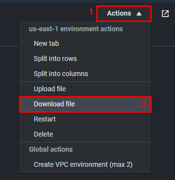
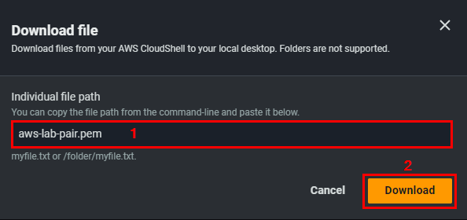
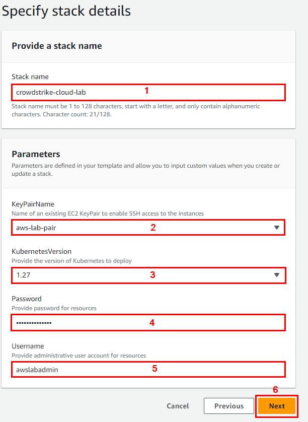
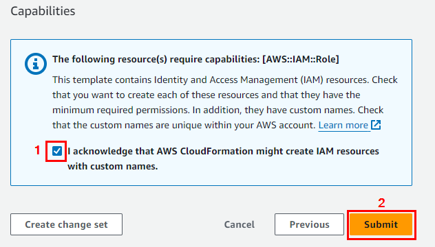
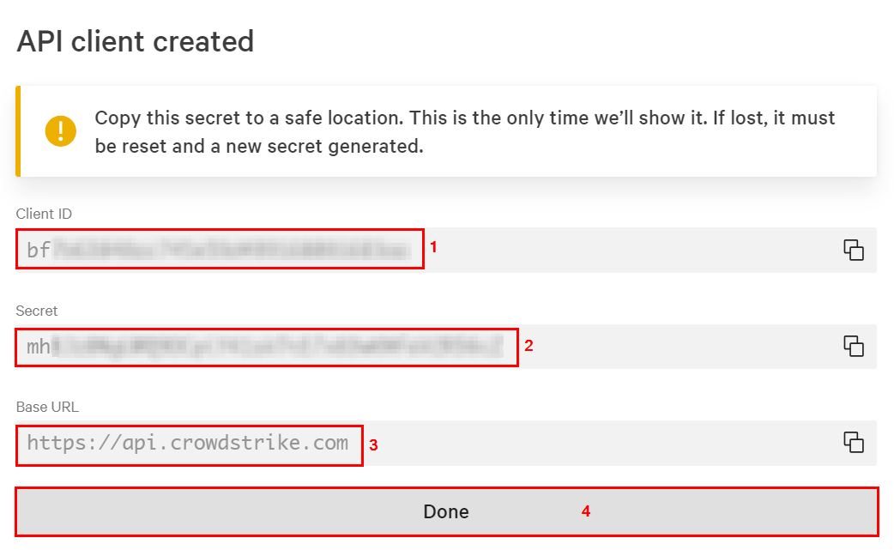
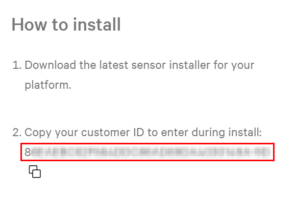

## Module 1 - Introduction - Provision AWS Resources

In this workshop lesson, you'll provision resources in your AWS subscription using a cloud formation template. The following list of resources will be deployed during the provisioning process (including dependencies like disks, network interfaces, public IP addresses, etc.):

Name | Resource Type | Purpose
-----| ------------- | -------
awslab-vpc | Virtual network | Virtual network that hosts both Azure VMs
awslab-win | EC2 instance | Windows Server to test the host protection capabilities of CrowdStrike Falcon
awslab-linux | EC2 instance | Linux Server to test the host protection capabilities of CrowdStrike Falcon
awslab-sg | Security group | Security group for the two EC2 instances
awslabcr[uniqestring]/apps | Container registry repository | Container registry to store application images
falcon-sensor/falcon-container | Container registry repository | Container registry to store falson sensor images
awslab-eks | Elastic Kubernetes service | Kubernetes service to test container security capabilities of CrowdStrike Falcon
awslab-ecs | Elastic Container service | For testing ECS fargate security capabilities of CrowdStrike Falcon
awslab-func-[uniqestring] | Lambda Function | Demonstrating related built-in and custom security recommendations
awslabstore[uniqestring] | S3 Bucket | Demonstrating related security recommendations
awslab-sql-[uniqestring] | RDS DB instance | To be using for the sample database
awslab-sm-[uniqestring] | AWS Secret Manager | For storing relevant secrets


### Deploy Workshop Resources Using an AWS Cloud Formation Template (Using AWS CloudShell)
1. Open a web browser and sign into the AWS console - https://console.aws.amazon.com/

2. In the top right corner, click the **`Cloud Shell`** icon to open it...


3. Create an AWS key pair that will be used to access the EC2 instances
```
aws ec2 create-key-pair --key-name aws-lab-pair --query 'KeyMaterial' --output text > aws-lab-pair.pem

chmod 400 aws-lab-pair.pem

ls -l aws-lab-pair.pem
```

4. Download the key to your system. In the Cloud Shell window, click on **`Actions`** → **`Download file`**. Enter **`aws-lab-pair.pem`**. Click **`Download`**.





5. Download the AWS Cloud Formation Template for the workshop.
```
curl -O https://raw.githubusercontent.com/davidokeyode/crowdstrike-handson-workshops/main/workshops/aws-cloud-protection/templates/awslabtemplatedeploy.yml
```

6. Deploy the template. The template deployment can take up to 25 minutes to complete.
> Replace **`COMPLEX_PASSWORD`** with a complex password.  
> The stack deployment starts and *could take up to 25 minutes to complete*.  
```
aws cloudformation create-stack --stack-name crowdstrike-cloud-lab --template-body "file://awslabtemplatedeploy.yml" --region us-east-1 --parameters ParameterKey=KeyPairName,ParameterValue="aws-lab-pair" ParameterKey=KubernetesVersion,ParameterValue="1.27" ParameterKey=Username,ParameterValue="awslabamin" ParameterKey=Password,ParameterValue="COMPLEX_PASSWORD" --capabilities CAPABILITY_NAMED_IAM
```

7. Monitor the deployment status uusing the command below:
```
while true; do
  STATUS=$(aws cloudformation describe-stacks \
    --stack-name crowdstrike-cloud-lab \
    --region us-east-1 \
    --query 'Stacks[0].StackStatus' \
    --output text)
  echo "Current status: $STATUS"
  
  if [[ "$STATUS" == "CREATE_COMPLETE" ]] || [[ "$STATUS" == "UPDATE_COMPLETE" ]]; then
    echo "Stack creation completed successfully."
    break
  elif [[ "$STATUS" == *"FAILED"* ]] || [[ "$STATUS" == *"ROLLBACK"* ]]; then
    echo "Stack creation failed."
    break
  else
    sleep 30
  fi
done
```

8. Retrieve the output from the template deployment as the values will be referenced in later modules.
```
aws cloudformation describe-stacks --region us-east-1 --stack-name crowdstrike-cloud-lab --query 'Stacks[*].Outputs[*].[OutputKey, OutputValue]' --output text > crowdstrike-cloud-lab-output.txt

cat crowdstrike-cloud-lab-output.txt
```

### Deploy Workshop Resources Using an AWS Cloud Formation Template (Using AWS Console)
1. **CNTRL + Click** (**CMD + Click** on MacOS) on one of the **Launch Stack** buttons below (depending on the region that you want to deploy into):

| AWS Region Code | Name | Launch |
| --- | --- | --- 
| us-east-1 |US East (N. Virginia)| [](https://console.aws.amazon.com/cloudformation/home?region=us-east-1#/stacks/new?stackName=crowdstrike-cloud-lab&templateURL=https://cfworkshoptemplates1001.s3.amazonaws.com/awslabtemplatedeploy.yml) |
| us-west-2 |US West (Oregon)| [](https://console.aws.amazon.com/cloudformation/home?region=us-west-2#/stacks/new?stackName=crowdstrike-cloud-lab&templateURL=https://cfworkshoptemplates1001.s3.amazonaws.com/awslabtemplatedeploy.yml) |

2.	You will be redirected to the AWS Console. On the **`Specify stack details`** page, configure the following:
* **Stack name**: crowdstrike-cloud-lab
* **KeyPairName**: Select your AWS key pair.
* **KubernetesVersion**: Select the Kubernetes version to deploy.
* **Username**: Leave the default value.
* **Password**: Enter a complex password. This password will be used for access to services like the RDS instance.
* Click **Next**



3. On the **`Configure stack options`** page, click **`Next`**

4. On the **`Review and create`** page, acknowledge that IAM resources will be created, then click **`Submit`**.



> The stack deployment starts and *could take up to 25 minutes to complete*.  

5. When the deployment is complete, you should see the view below. You can click on **`Outputs`** to view some information that you will need for subsequent labs. Make note of the information here.


### Prepare CrowdStrike Falcon
1. **Create a CrowdStrike Falcon API client key**
* **`Falcon console`** → **`Support and resources`** → **`Resources and tools`** → **`API clients and keys`** → **`OAuth2 API clients`** → **`Create API client`**
  * **`Client name`**: crowdstrike-workshop-api
  * **`Description`**: API key used in the CrowdStrike cloud workshop labs
  * **`Scope`**: Select Read and Write for all scopes
  * Create
  * Make a note of the **`Client ID`**, **`Secret`**, and **`Base URL`**. You will need them in upcoming modules.



2. **Get your Falcon CID**.
* **`Falcon console`** → **`Host setup and management`** → **`Deploy`** → **`Sensor downloads`**
* In the **`How to install`** section, make a note of the **`Customer ID`**. You will need this value in upcoming modules.



### Next steps
In this lesson, you provisioned resources in your AWS account using a Cloud Formation template.

Proceed to the next lesson:
> [Onboard your AWS account to CrowdStrike Falcon](2-onboard-aws-account.md)