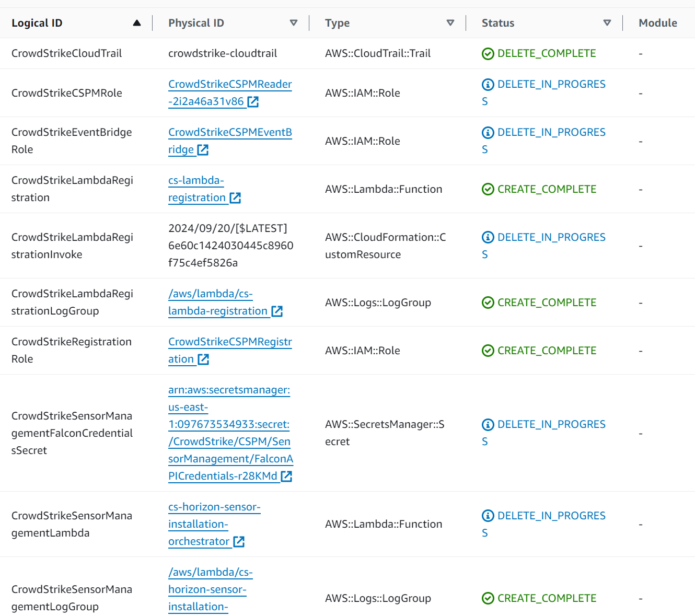
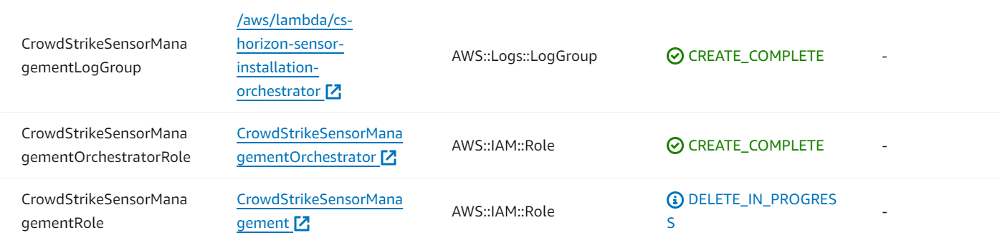
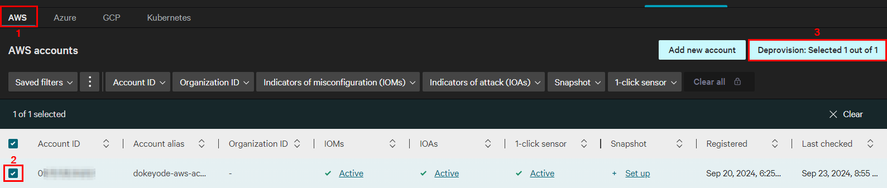
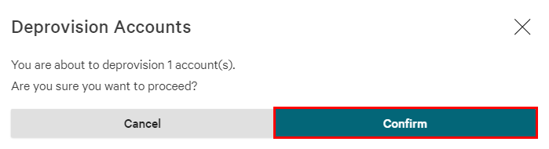
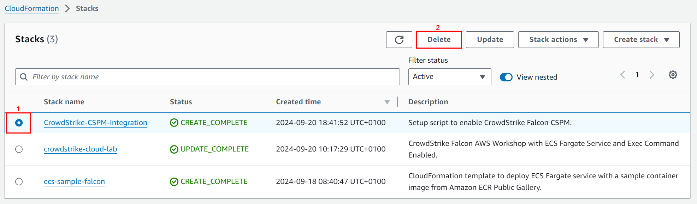
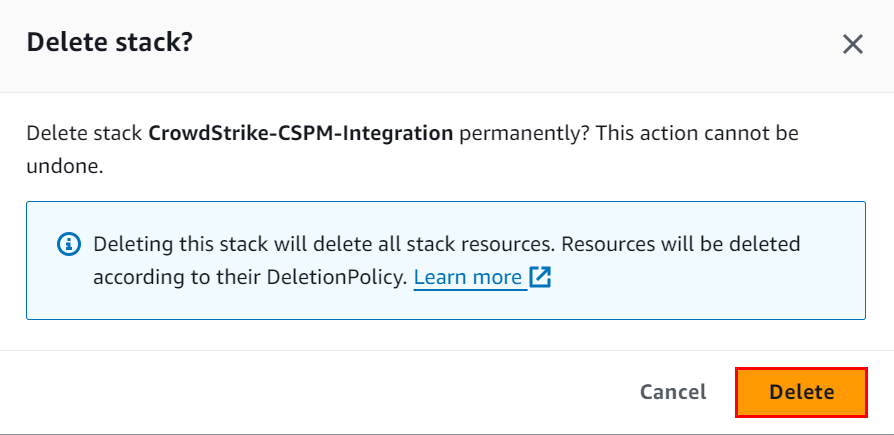

### Onboard AWS account

### What resources are created?

### Deprovision AWS account

1. **Create a CrowdStrike Falcon API client key**
* **`Falcon console`** → **`Cloud Security`** → **`Settings`** → **`Account registration`** → **`AWS`**
  * Select the account → Click on **`Deprovision`**
  * Click on **`Confirm`** to start the deprovision process

2. On the **`Deprovisioning an account`** pop-up, expand the option **`For individual (non-org) account`**.
* To deprovision an individual account, we need to do two things:
    * Delete the CloudFormation stack that starts with the name **`Crowdstrike-CSPM-Integration`**
    * If agentless (snapshot scanning) was enabled, delete the CloudFormation stack that starts with the name **`CrowdStrike-CSPM-Snapshots-Scanning`**

3. Delete the CloudFormation stack that starts with the name **`Crowdstrike-CSPM-Integration`**
* AWS Console → **`CloudFormation`** → **`Stacks`**

4. On the **`Delete stack?`** pop-up, click on **`Delete`**.
> Wait for the delete process to complete

