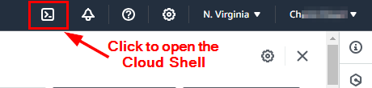

### Protecting container workloads in ECS Fargate
1. There are two approaches to deploy the Falcon container sensor for protection
* **a. Task definition patch model**
  * Modify the Fargate task definition (patching the taskdefinition)
  * Uses the task definition
  * This can be automated pre-runtime or after runtime using the s and create new revisions

* **b. Embedded sensor model**
  * Embedding the sensor into the app container
  * This is not yet released. It will be part of the Falcon sensor 7.19 release
  * This will allow customers to embed the Falcon container sensor into the application image without the need for a patching utility


### Supported features


### Prepare the Linux EC2 instance
1. Open a web browser and sign into the AWS console - https://console.aws.amazon.com/

2. In the top right corner, click the **`Cloud Shell`** icon to open it...



3. Create an AWS key pair that will be used to access the EC2 instances
> Replace **`<LinuxVMHostname>`** with the actual value from the output that you made a note of in Module 1
```
ssh -i aws-lab-pair.pem ubuntu@<LinuxVMHostname>

sudo su -
```

4. Install Docker
```
curl -fsSL https://test.docker.com -o test-docker.sh
sudo sh test-docker.sh
docker -v
```

5. Install JQ and Unzip
```
apt install jq unzip -y
```

6. Install AWS CLI
```
apt install unzip -y
curl "https://awscli.amazonaws.com/awscli-exe-linux-x86_64.zip" -o "awscliv2.zip"
unzip awscliv2.zip
sudo ./aws/install

aws --version
```

7. Authenticate to your AWS account using AWS CLI
```
aws configure
Default region name [None]: us-east-1
```

8. Install the Session Manager plugin
```
curl "https://s3.amazonaws.com/session-manager-downloads/plugin/latest/ubuntu_64bit/session-manager-plugin.deb" -o "session-manager-plugin.deb"

sudo dpkg -i session-manager-plugin.deb
```

### Implement a protected Fargate task
1. **Configure your Falcon API key and secret as environment variables.**
* Replace the placeholders with the actual values that you made a note of in Module 1.
* This is needed to download the Falcon sensor image. 
```
export FALCON_CLIENT_ID=[PLACEHOLDER]
export FALCON_CLIENT_SECRET=[PLACEHOLDER]
```

2. **Configure your Falcon CID as an environment variable.**
* This is needed to download the Falcon sensor image. 
```
export FALCON_CID=[PLACEHOLDER]
```

3. **Download the Falcon sensor container image from the CrowdStrike registry and push it into ECR.**
* To do this, we will run the container pull script. The script uses your CrowdStrike API Client ID and Secret to fetch CrowdStrike registry credentials, sets up your local Docker client, and pulls the latest sensor image. The sensor image URI is then saved as the environment variable **`$LATESTSENSOR`**.

a. **Run the Falcon Container sensor pull script to fetch the latest image**:
```
export LATESTSENSOR=$(bash <(curl -Ls https://github.com/CrowdStrike/falcon-scripts/releases/latest/download/falcon-container-sensor-pull.sh) -t falcon-container | tail -1) && echo $LATESTSENSOR

echo $LATESTSENSOR

docker image ls
```

b. **Set the new ECR falcon image repo as a variable**:
* This repository was created as part of the template deployment in Module 1.
``` 
export AWS_REPO=$(aws ecr describe-repositories --repository-name falcon-sensor/falcon-container | jq -r '.repositories[].repositoryUri' | tail -1) && echo $AWS_REPO

export AWS_REPO_NAME=$(aws ecr describe-repositories --repository-name falcon-sensor/falcon-container --query "repositories[0].repositoryUri" --output text | cut -d'/' -f1)

echo $AWS_REPO
echo $AWS_REPO_NAME
```

c. **Tag the sensor image and push it into the ECR repo**:
```
docker tag "$LATESTSENSOR" "$AWS_REPO":latest

aws ecr get-login-password --region us-east-1 | docker login --username AWS --password-stdin $AWS_REPO_NAME

docker push "$AWS_REPO":latest
```

4. Download the ECS Fargate task definition
```
mkdir -p ecs-sample

curl -o ecs-sample/ecs-sample-task-b.json https://raw.githubusercontent.com/davidokeyode/crowdstrike-workshop-labs/main/workshops/aws-cloud-protection/templates/ecs-sample-task-b.json
```

5. Set up authentication for the patching utility
* The ECS patching utility needs to be able to query the customer-defined images wherever they are hosted. It supports image pull token or repository credentials for image registry authentication.

```
IMAGE_PULL_TOKEN=$(echo "{\"auths\":{\"$AWS_REPO_NAME\":{\"auth\":\"$(echo AWS:$(aws ecr get-login-password)|base64 -w 0)\"}}}" | base64 -w 0)

echo $IMAGE_PULL_TOKEN

docker run -v /root/ecs-sample/:/var/run/spec --rm "$AWS_REPO":latest -cid $FALCON_CID -image "$AWS_REPO":latest -pulltoken $IMAGE_PULL_TOKEN -ecs-spec-file /var/run/spec/ecs-sample-task-b.json > ecs-sample-task-falcon-b.json

cat ecs-sample-task-falcon-b.json
```

6. Modify the placeholders in the task definition file with the values from Module 1.
* **`ECSTaskExecutionRole ARN`**
* **`ECSTaskRole ARN`**

```
vim ecs-sample-task-falcon-b.json
```

7. Deploy the protected ECS Fargate task

a. **Register the new task definition**
* Take note of the revision number
```
aws ecs register-task-definition --cli-input-json file://ecs-sample-task-falcon-b.json

revision_number=$(aws ecs register-task-definition --cli-input-json file://ecs-sample-task-falcon-b.json | jq -r '.taskDefinition.revision')
```

b. **Update the ECS Service to Use the New Task Definition**
```
aws ecs list-services --cluster awslab-ecs 

service_name=$(aws ecs list-services --cluster awslab-ecs | jq -r '.serviceArns[0] | split("/")[-1]')

echo $service_name

aws ecs update-service --cluster awslab-ecs --service $service_name --task-definition ECSFargateTaskDefinition:$revision_number
```

c. **Verify the update**
```
aws ecs describe-services --cluster awslab-ecs --services $service_name
```

d. **Exec into the container**:
```
task_arn=$(aws ecs describe-services --cluster awslab-ecs --services $service_name | jq -r '.services[0].deployments[0].taskDefinition')

container_name=$(aws ecs describe-task-definition --task-definition $task_arn | jq -r '.taskDefinition.containerDefinitions[0].name')

task_id=$(aws ecs list-tasks --cluster awslab-ecs --service-name $service_name | jq -r '.taskArns[0]' | awk -F'/' '{print $NF}')

aws ecs execute-command --cluster "awslab-ecs" --task $task_id --container $container_name --interactive --command "/bin/sh"
```

### Verify in the CrowdStrike Falcon Console

