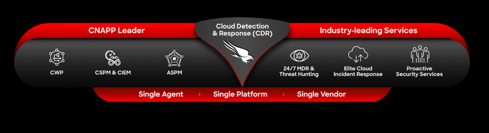

## Welcome

Welcome to the Falcon Cloud Security Azure workshop! The CrowdStrike Falcon platform offers a comprehensive CNAPP solution for protecting critical multi-cloud and cloud-native assets. It provides comprehensive visibility, threat detection and threat protection across your organization's hybrid, multi-cloud environment (AWS, Azure, GCP, Kubernetes, OpenShift). 

This workshop was created as a walkthrough for an in person or virtual workshop, however you may feel free to run through it at your own pace.

### Pre-requisites

* An Azure Subscription
  * This can be any Azure subscription where you have the owner role assignment. We will also be performing some actions in Entra ID and other services that may require the Application Administrator or Global Administrator level of access on the tenant level.

*  You will need to have access to a CrowdStrike Falcon account to complete the workshop.
  * CrowdStrike Falcon will be used to protect your Azure environment, services and workloads.
* An Azure DevOps Organization
* A GitHub Account
* A JIRA Account

### Agenda

The workshop is designed to take approximately 5-6 hours to complete. It can be spread out over a 1 day or 2 days workshop.

|    | Module                   | Format       |
|----|--------------------------|--------------|
| 01 | [Prepare Your Azure Environment](modules/1-prepare-the-environment.md) | Hands on Lab |
| 02 | [Onboard Azure Tenants and Subscriptions to Falcon Cloud Security](modules/2b-cspm-ioa-onboarding.md) | Hands on Lab |
| 03 | [Scan Azure Infrastructure as Code (IaC) Templates](modules/5-iac-scanning.md)                | Hands on Lab |
| 04 | [Assess Container Images in a CICD Pipeline](modules/8a-image-assessment-cicd.md) | Hands on Lab |
| 05 | [Protect Azure Container Registry (ACR) Images](modules/9a-protect-acr-images-password.md)  | Hands on Lab |
| 06 | [Protect Azure Kubernetes Service (AKS) Workloads](modules/10a-protect-aks-workloads.md) | Hands on Lab |
| 07 | [Protect Linux Hosts and Containers in Azure](modules/7-protect-linux-hosts-and-containers.md) | Hands on Lab |
| 08 | [Protect Windows Hosts and Containers in Azure](modules/8-protect-windows-hosts-and-containers.md) | Hands on Lab |
| 09 | [Protect Serverless Container Workloads](modules/9-protect-acr-images.md)    | Hands on Lab |
| 10 | [Implement Shift-Left Security in Azure DevOps](modules/12-implement-shift-left-security.md)    | Hands on Lab |
| 11 | Wrap / Clean Up     | Hands on Lab |
----

[Next](modules/1-prepare-the-environment.md)