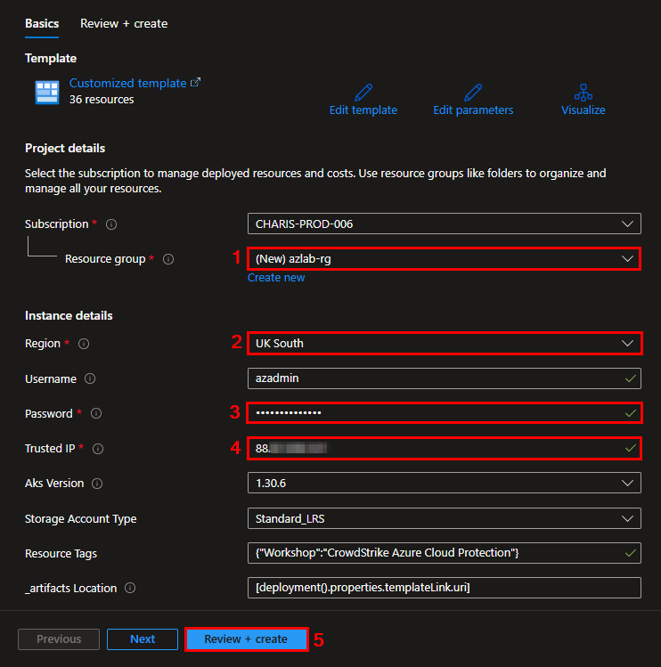

# Module 1 - Introduction - Provision Azure Resources

In this workshop lesson, you'll provision resources in your Azure subscription using an ARM template.
The following list of resources will be deployed during the provisioning process (including dependencies like disks, network interfaces, public IP addresses, etc.):

Name | Resource Type | Purpose
-----| ------------- | -------
azlab-vnet | Virtual network | Virtual network that hosts both Azure VMs
azlab-win | Virtual machine | Windows Server to test the host protection capabilities of CrowdStrike Falcon
azlab-linux | Virtual machine | Linux Server to test the host protection capabilities of CrowdStrike Falcon
azlab-nsg | Network security group | NSG for the 2-VMs
azlabcr[uniqestring] | Container registry | Container registry to store application images
azlab-aks | Kubernetes service | Kubernetes service to test container security capabilities of CrowdStrike Falcon
azlab-fa-[uniqestring] | Function App | Demonstrating related built-in and custom security recommendations
azlab-splan | App Service plan | App Service plan to host the containerized web app
azlab-app-[uniqestring] | App Service | App service to be for hosting a containerized web app
azlabsa[uniqestring] | Storage account | Demonstrating related security recommendations
azlab-sql-[uniqestring] | SQL server | To be using for the sample database
azlab-as | SQL database | Sample database based on AdventureWorks template
azlab-kv-[uniqestring] | Key vault | Demonstrating Key Vault related recommendations and security alerts

### Excercise 1: Deploy Workshop Resources Using an ARM Template
1. **CNTRL + Click** (**CMD + Click** on MacOS) on the **Deploy to Azure** button below:

2.	You will be redirected to the Azure Portal, the custom deployment page where you should specify mandatory fields for deployment. Configure the following settings:
* **Subscription**: Select the Azure subscription that you want to deploy the resources into
* **Resource Group**: Click on **Create New** → Name: **`azlab-rg`**
* **Region**: Select an Azure region close to your current location
* **Username**: Leave the default value
* **Password**: Enter a complex password. This password will be used across services like VMs and SQL databases
* **Storage Account Type**: Leave the default value
* **Resource Tags**: Leave the default value
* **_artifacts Location**: Leave the default value
* **_artifacts Location Sas Token**: Leave the default value
* Click **Review and Create**

3. After the validation passed, click on **Create**

> The *deployment is in progress* page continues to update and shows the resources as they deployed.  
> Be aware than an additional resource group will be created automatically for Kubernetes resources named as "azlab-aks".
> The deployment can take up to 25 minutes to complete.

4. When the deployment is complete, you should see the view below. You can click on **Outputs** to view some information that you will need for subsequent labs. Make note of the information here.

### Exercise 2: Prepare CrowdStrike Falcon
1. **Create a CrowdStrike Falcon API client key**
* **`Falcon console`** → **`Support and resources`** → **`Resources and tools`** → **`API clients and keys`** → **`OAuth2 API clients`** → **`Create API client`**
  * **`Client name`**: crowdstrike-workshop-api
  * **`Description`**: API key used in the CrowdStrike cloud workshop labs
  * **`Scope`**: Select Read and Write for all scopes
  * Create
  * Make a note of the **`Client ID`**, **`Secret`**, and **`Base URL`**. You will need them in upcoming modules.

2. **Get your Falcon CID**.
* **`Falcon console`** → **`Host setup and management`** → **`Deploy`** → **`Sensor downloads`**
* In the **`How to install`** section, make a note of the **`Customer ID`**. You will need this value in upcoming modules.

## Next steps

In this lesson, you provisioned resources in your Azure subscription using an ARM template, and created an API client in the Falcon Console.

Proceed to the next lesson:
> [Onboard Azure Subscription to CrowdStrike Falcon](2-onboard-azure-sub.md)
