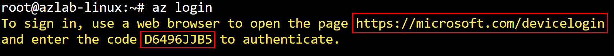

## Module 10 - Introduction - Protect Azure Kubernetes Service (AKS) Workloads
In this module, we will begin to walk through the process of installing the CrowdStrike Falcon sensor/agents to protect workloads in an AKS cluster. Here are the exercises that we will complete:

> * Connect to the Linux VM and establish connection to the AKS cluster
> * Install the Falcon Sensor to AKS
> * Install the Falcon KAC (Kubernetes Admissions Controller)
> * Install the Falcon KPA (Kubernetes Protection Agent)
> * Install the Falcon IAR (Image Assessment at Runtime)
> * Troubleshooting AKS Sensor/Agent Deployments
> * Prevent untrusted images from being deployed to AKS

## Exercise 1 - Connect to the Linux VM and establish connection to the AKS cluster
1. **Obtain the **`Linux VM SSH Command`** from the output of the template deployment in **`Module 1`** and use it to SSH into the Linux VM.**


2. **Enter **`yes`** and press **`Enter`** when prompted with a certificate warning. When prompted to enter a password, enter the password that you used for the template deployment and press **`Enter`**. **


3. **Switch to the root user using the command below:**
```
sudo su -
```

4. **In the SSH session to the Linux VM, check that the necesary tools are installed using the commands below:**
* **`Azure CLI`**
* **`Docker`**
* **`Helm`**
* **`Kubectl`**
```
az --version
docker --version
helm version
kubectl version --client
```

5. **Authenticate to Azure using the Azure CLI tool:**
```
az login
```

6. **Follow the displayed guidance by going to **`https://microsoft.com/devicelogin`**, enter the displayed code, then cllick on **`Next`**.**




7. **Retrieve the credentials for your AKS cluster and verify the connection:**
```
rg="azlab-rg"
aks="azlab-aks"
az aks get-credentials --resource-group $rg --name $aks

kubectl get nodes
```


## Exercise 2 - Install the Falcon Sensor to AKS
1. **Download the script that will collect all information from the CrowdStrike API:**
```
curl -sSL -o falcon-container-sensor-pull.sh "https://github.com/CrowdStrike/falcon-scripts/releases/latest/download/falcon-container-sensor-pull.sh"

chmod +x falcon-container-sensor-pull.sh
```

2. **Configure your CrowdStrike API credentials**
* API Scopes needed:
  * Falcon Image Download (read)
  * Sensor Download (read)
* Replace **`YOUR_CLIENT_ID`** and **`YOUR_CLIENT_SECRET`** with the values that you made a note of in Module 1
```
export FALCON_CLIENT_ID=YOUR_CLIENT_ID
export FALCON_CLIENT_SECRET=YOUR_CLIENT_SECRET
```

3. **Retrieve the Falcon CID**
* Falcon Console → Host setup and management → Deploy → Sensor downloads → Copy ID (right side)
```
export FALCON_CID=$( ./falcon-container-sensor-pull.sh -t falcon-sensor --get-cid )

OR

FALCON_TOKEN=$(curl -X POST "https://api.crowdstrike.com/oauth2/token" \
 -H "accept: application/json" \
 -H "Content-Type: application/x-www-form-urlencoded" \
 -d "client_id=$FALCON_CLIENT_ID&client_secret=$FALCON_CLIENT_SECRET" \
 | jq -r '.access_token')

export FALCON_CID=$(curl -X GET "https://api.crowdstrike.com/sensors/queries/installers/ccid/v1" -H "accept: application/json" -H "authorization: Bearer $FALCON_TOKEN" | jq -r '.resources[0]')

echo $FALCON_CID
```

4. **Retrieve the Falcon sensor container image full path, image repo, image tag, and pull token.**
```
export FALCON_IMAGE_FULL_PATH=$( ./falcon-container-sensor-pull.sh -t falcon-sensor --get-image-path )
export FALCON_IMAGE_REPO=$( echo $FALCON_IMAGE_FULL_PATH | cut -d':' -f 1 )
export FALCON_IMAGE_TAG=$( echo $FALCON_IMAGE_FULL_PATH | cut -d':' -f 2 )
export FALCON_IMAGE_PULL_TOKEN=$( ./falcon-container-sensor-pull.sh -t falcon-sensor --get-pull-token )

cat << EOF
=====================
CID: $FALCON_CID
Full image path: $FALCON_IMAGE_FULL_PATH
Falcon Image Repo: $FALCON_IMAGE_REPO
Falcon Image Tag: $FALCON_IMAGE_TAG
EOF
```

5. **Install the Falcon Sensor**
* Modify the **`falcon.tags`** as needed
```
helm repo add crowdstrike https://crowdstrike.github.io/falcon-helm --force-update

helm upgrade --install falcon-sensor crowdstrike/falcon-sensor -n falcon-system --create-namespace \
--set falcon.cid="$FALCON_CID" \
--set falcon.tags="daemonset\,pov-crwd\,falcon-sensor\,azlab-aks" \
--set node.image.repository="$FALCON_IMAGE_REPO" \
--set node.image.tag="$FALCON_IMAGE_TAG" \
--set node.image.registryConfigJSON="$FALCON_IMAGE_PULL_TOKEN"
```

6. **Verify installation**
```
kubectl get namespaces

kubectl get pods -n falcon-system
kubectl get pods -n falcon-system -w

kubectl get ds -n falcon-system
```

7. **Scale out the AKS cluster and verify that the sensor is deployed to the new node**
```
rg="azlab-rg"
aks="azlab-aks"
pool="agentpool"

az aks nodepool list --resource-group $rg --cluster-name $aks -o table
az aks nodepool scale --resource-group $rg --cluster-name $aks --name $pool --node-count 2
az aks nodepool show --resource-group $rg --cluster-name $aks --name $pool -o table

kubectl get ds -n falcon-system
kubectl get pods -n falcon-system -w
```

## Exercise 3 - Install the Falcon KAC (Kubernetes Admissions Controller)
1. **Download the script that will collect all information from the CrowdStrike API:**
```
curl -sSL -o falcon-container-sensor-pull.sh "https://github.com/CrowdStrike/falcon-scripts/releases/latest/download/falcon-container-sensor-pull.sh"

chmod +x falcon-container-sensor-pull.sh
```

2. **Configure your CrowdStrike API credentials**
* API Scopes needed:
  * Falcon Image Download (read)
  * Sensor Download (read)
* Replace YOUR_CLIENT_ID and YOUR_CLIENT_SECRET with the values that you made a note of in Module 1
```
export FALCON_CLIENT_ID=YOUR_CLIENT_ID
export FALCON_CLIENT_SECRET=YOUR_CLIENT_SECRET
```

3. **Retrieve the Falcon CID**
* Falcon Console → Host setup and management → Deploy → Sensor downloads → Copy ID (right side)
```
export FALCON_CID=$( ./falcon-container-sensor-pull.sh -t falcon-kac --get-cid )

OR

FALCON_TOKEN=$(curl -X POST "https://api.crowdstrike.com/oauth2/token" \
 -H "accept: application/json" \
 -H "Content-Type: application/x-www-form-urlencoded" \
 -d "client_id=$FALCON_CLIENT_ID&client_secret=$FALCON_CLIENT_SECRET" \
 | jq -r '.access_token')

export FALCON_CID=$(curl -X GET "https://api.crowdstrike.com/sensors/queries/installers/ccid/v1" -H "accept: application/json" -H "authorization: Bearer $FALCON_TOKEN" | jq -r '.resources[0]')

echo $FALCON_CID
```

4. **Retrieve the Falcon KAC container image full path, image repo, image tag, and pull token.**
```
export FALCON_KAC_IMAGE_FULL_PATH=$( ./falcon-container-sensor-pull.sh -t falcon-kac --get-image-path )
export FALCON_KAC_IMAGE_REPO=$( echo $FALCON_KAC_IMAGE_FULL_PATH | cut -d':' -f 1 )
export FALCON_KAC_IMAGE_TAG=$( echo $FALCON_KAC_IMAGE_FULL_PATH | cut -d':' -f 2 )
export FALCON_IMAGE_PULL_TOKEN=$( ./falcon-container-sensor-pull.sh -t falcon-kac --get-pull-token )

cat << EOF
=====================
CID: $FALCON_CID
Full KAC Image path: $FALCON_KAC_IMAGE_FULL_PATH
Falcon KAC Image Repo: $FALCON_KAC_IMAGE_REPO
Falcon KAC Image Tag: $FALCON_KAC_IMAGE_TAG
EOF
```

5. **Install the Falcon KAC**
* Modify the **`falcon.tags`** as needed
```
helm repo add crowdstrike https://crowdstrike.github.io/falcon-helm --force-update

helm upgrade --install falcon-kac crowdstrike/falcon-kac -n falcon-kac --create-namespace \
--set falcon.cid="$FALCON_CID" \
--set falcon.tags="kac\,pov-crwd\,falcon-kac\,azlab-aks" \
--set image.repository="$FALCON_KAC_IMAGE_REPO" \
--set image.tag="$FALCON_KAC_IMAGE_TAG" \
--set image.registryConfigJSON="$FALCON_IMAGE_PULL_TOKEN"
```

6. **Verify installation**
```
kubectl get namespaces

kubectl get pods -n falcon-kac
kubectl get pods -n falcon-kac -w

kubectl get deployment -n falcon-kac
```


## Exercise 4 - Install the Falcon KPA (Kubernetes Protection Agent)
1. **Download the script that will collect all information from the CrowdStrike API:**
```
curl -sSL -o falcon-container-sensor-pull.sh "https://github.com/CrowdStrike/falcon-scripts/releases/latest/download/falcon-container-sensor-pull.sh"

chmod +x falcon-container-sensor-pull.sh
```

2. **Configure your CrowdStrike API credentials**
* API Scopes needed:
  * Falcon Image Download (read)
  * Sensor Download (read)
  * Kubernetes Protection (read)
  * Kubernetes Protection Agent (write)
* Replace **`YOUR_CLIENT_ID`** and **`YOUR_CLIENT_SECRET`** with the values that you made a note of in **`Module 1`**
```
export FALCON_CLIENT_ID=YOUR_CLIENT_ID
export FALCON_CLIENT_SECRET=YOUR_CLIENT_SECRET
```

3. **Retrieve the Falcon CID**
* **`Falcon Console`** → **`Host setup and management`** → **`Deploy`** → **`Sensor downloads`** → **`Copy ID`** (right side)
```
export FALCON_CID_KPA=$( ./falcon-container-sensor-pull.sh -t kpagent --get-cid )

echo $FALCON_CID_KPA
```

4. **Configure the cluster name and Falcon cloud environment variables**
```
subid=$(az account show --query id --output tsv)
rg="azlab-rg"
aks="azlab-aks"

FALCON_KPA_CLUSTER_NAME="/subscriptions/$subid/resourcegroups/$rg/providers/microsoft.containerservice/managedclusters/$aks"

FALCON_CLOUD_ENV=us-1

** us-1; us-2; eu-1; us-gov-1; us-gov-2
```

5. **Retrieve the Falcon KAC container image full path, image repo, image tag, and pull token.**
```
export FALCON_KPA_IMAGE_FULL_PATH=$( ./falcon-container-sensor-pull.sh -t kpagent --get-image-path )
export FALCON_KPA_IMAGE_REPO=$( echo $FALCON_KPA_IMAGE_FULL_PATH | cut -d':' -f 1 )
export FALCON_KPA_IMAGE_TAG=$( echo $FALCON_KPA_IMAGE_FULL_PATH | cut -d':' -f 2 )
export FALCON_IMAGE_PULL_TOKEN=$( ./falcon-container-sensor-pull.sh -t kpagent --get-pull-token )

cat << EOF
=====================
CID: $FALCON_CID_KPA
Full KPA Image path: $FALCON_KPA_IMAGE_FULL_PATH
Falcon KPA Image Repo: $FALCON_KPA_IMAGE_REPO
Falcon KPA Image Tag: $FALCON_KPA_IMAGE_TAG
Cluster name: $FALCON_KPA_CLUSTER_NAME
Region: $FALCON_CLOUD_ENV
EOF
```

6. **Install the Falcon KPA**
* Modify the **`falcon.tags`** as needed
```
helm repo add crowdstrike https://crowdstrike.github.io/falcon-helm --force-update

helm upgrade --install kpagent crowdstrike/cs-k8s-protection-agent -n falcon-kubernetes-protection --create-namespace \
--set image.registryConfigJSON=$FALCON_IMAGE_PULL_TOKEN \
--set image.repository=$FALCON_KPA_IMAGE_REPO \
--set image.tag=$FALCON_KPA_IMAGE_TAG \
--set crowdstrikeConfig.cid=$FALCON_CID_KPA \
--set crowdstrikeConfig.clientID=$FALCON_CLIENT_ID \
--set crowdstrikeConfig.clientSecret=$FALCON_CLIENT_SECRET \
--set crowdstrikeConfig.clusterName=$FALCON_KPA_CLUSTER_NAME \
--set crowdstrikeConfig.env=$FALCON_CLOUD_ENV
```

6. **Verify installation**
```
kubectl get namespaces

kubectl get pods -n falcon-kubernetes-protection
kubectl get pods -n falcon-kubernetes-protection -w

kubectl get deployment -n falcon-kubernetes-protection
```

7. **(OPTIONAL) Remove installation**
```
helm uninstall kpagent -n falcon-kubernetes-protection
kubectl delete namespace falcon-kubernetes-protection
```

## Exercise 5 - Install the Falcon IAR (Image Assessment at Runtime)
1. **Download the script that will collect all information from the CrowdStrike API:**
```
curl -sSL -o falcon-container-sensor-pull.sh "https://github.com/CrowdStrike/falcon-scripts/releases/latest/download/falcon-container-sensor-pull.sh"

chmod +x falcon-container-sensor-pull.sh
```

2. **Configure your CrowdStrike API credentials**
* API Scopes needed:
  * Falcon Image Download (read)
  * Sensor Download (read)
  * Falcon Container Image (read/write)
  *	Falcon Container CLI (write)
* Replace YOUR_CLIENT_ID and YOUR_CLIENT_SECRET with the values that you made a note of in Module 1
```
export FALCON_CLIENT_ID=YOUR_CLIENT_ID
export FALCON_CLIENT_SECRET=YOUR_CLIENT_SECRET
```

3. **Retrieve the Falcon CID**
* Falcon Console → Host setup and management → Deploy → Sensor downloads → Copy ID (right side)
```
export FALCON_CID=$( ./falcon-container-sensor-pull.sh -t falcon-imageanalyzer --get-cid )

OR

FALCON_TOKEN=$(curl -X POST "https://api.crowdstrike.com/oauth2/token" \
 -H "accept: application/json" \
 -H "Content-Type: application/x-www-form-urlencoded" \
 -d "client_id=$FALCON_CLIENT_ID&client_secret=$FALCON_CLIENT_SECRET" \
 | jq -r '.access_token')

export FALCON_CID=$(curl -X GET "https://api.crowdstrike.com/sensors/queries/installers/ccid/v1" -H "accept: application/json" -H "authorization: Bearer $FALCON_TOKEN" | jq -r '.resources[0]')

echo $FALCON_CID
```

4. **Configure the cluster name and Falcon cloud environment variables**
```
subid=$(az account show --query id --output tsv)
rg="azlab-rg"
aks="azlab-aks"

FALCON_IAR_CLUSTER_NAME="$aks"

FALCON_CLOUD_ENV=us-1

** us-1; us-2; eu-1; us-gov-1; us-gov-2
```

5. **Retrieve the Falcon image analyzer container image full path, image repo, image tag, and pull token.**
```
export FALCON_IMAGE_FULL_PATH=$( ./falcon-container-sensor-pull.sh -t falcon-imageanalyzer --get-image-path )
export FALCON_IMAGE_REPO=$( echo $FALCON_IMAGE_FULL_PATH | cut -d':' -f 1 )
export FALCON_IMAGE_TAG=$( echo $FALCON_IMAGE_FULL_PATH | cut -d':' -f 2 )
export FALCON_IMAGE_PULL_TOKEN=$( ./falcon-container-sensor-pull.sh -t falcon-imageanalyzer --get-pull-token )

cat << EOF
=====================
CID: $FALCON_CID
Full IAR Image path: $FALCON_IMAGE_FULL_PATH
Falcon IAR Image Repo: $FALCON_IMAGE_REPO
Falcon IAR Image Tag: $FALCON_IMAGE_TAG
Falcon Cloud ENV: $FALCON_CLOUD_ENV
IAR Cluster Name: $FALCON_IAR_CLUSTER_NAME
EOF
```

6. **Install the Falcon IAR**
* Modify the **`falcon.tags`** as needed
```
helm repo add crowdstrike https://crowdstrike.github.io/falcon-helm --force-update

helm upgrade --install iar crowdstrike/falcon-image-analyzer \
  -n falcon-image-analyzer --create-namespace \
  --set deployment.enabled=true \
  --set crowdstrikeConfig.cid="$FALCON_CID" \
  --set crowdstrikeConfig.clusterName="$FALCON_IAR_CLUSTER_NAME" \
  --set crowdstrikeConfig.clientID=$FALCON_CLIENT_ID \
  --set crowdstrikeConfig.clientSecret=$FALCON_CLIENT_SECRET \
  --set crowdstrikeConfig.agentRegion=$FALCON_CLOUD_ENV \
  --set image.registryConfigJSON=$FALCON_IMAGE_PULL_TOKEN \
  --set image.repository="$FALCON_IMAGE_REPO" \
  --set image.tag="$FALCON_IMAGE_TAG"
```

7. **Verify installation**
```
kubectl get namespaces

kubectl get pods -n falcon-image-analyzer
kubectl get pods -n falcon-image-analyzer -w

kubectl get deployment -n falcon-image-analyzer
```

7. **(OPTIONAL) Remove installation**
```
helm uninstall iar -n falcon-image-analyzer
kubectl delete namespace falcon-image-analyzer
```

## Troublshoot Installation

1. Get all pods that are ruunning in Falcon namespaces
```
kubectl get pods --all-namespaces -o custom-columns=NAMESPACE:.metadata.namespace,NAME:.metadata.name | grep '^falcon'
```

2. Get the IP addresses of the Pods
```
kubectl get pods --all-namespaces -o custom-columns=NAMESPACE:.metadata.namespace,NAME:.metadata.name,IP:.status.podIP | grep '^falcon'
```


## Exercise 6 - Deploy Sample App to AKS

1. **Open the Cloud Shell**

2. **If you have more than one Azure subscription, ensure you are in the right one that you deployed the lab resources into**
```
az account show
az account list -o table
az account set -s <subscription_name>
```

3. **Configure kubectl to connect to your Kubernetes cluster, use the `az aks get-credentials` command. `Kubectl` is pre-installed in the Azure cloud shell.** 
```
az aks get-credentials --resource-group azlab-rg --name azlab-aks
```

4. **To verify the connection to your cluster, run the `kubectl` get nodes command to return a list of the cluster nodes.**
```
kubectl get nodes
```

5. **Create namespace**
```
kubectl create namespace sock-shop
```

6. **Clone the `microservices-demo` repository**
```
git clone https://github.com/davidokeyode/microservices-demo.git
```

7. **Go to the `deploy/kubernetes` folder**
```
cd microservices-demo/deploy/kubernetes
```

8. **Review file**
```
code aks-complete-demo.yaml
```

9. **Deploy app**
```
kubectl apply -f aks-complete-demo.yaml
```

10. **Get public IP of front-end**
```
kubectl get services --selector=name=front-end -n sock-shop -o wide
kubectl get services -n sock-shop
```

11. **Browse to it**
```
http://<EXTERNAL-IP>
```