## Module 2 - Introduction - Onboard Azure Subscription to Falcon Cloud Security
In previous modules, you created the accounts that you need to complete the workshop and deployed test workloads in your Azure subscription. If you have not completed that lesson, you can refer to it [here](1-prepare-the-environment.md). In this module, you will add your Azure tenant and subscription to Falcon Cloud Security. This is one of the first steps to protecting your cloud environment, services and workloads with Falcon Cloud Security. Onboarding gives Falcon Cloud Security the permissions needed to ingest resource configuration metadata and activity logs from your Azure environment. Here are the exercises that we will be completing:

> * Review the permissions needed to complete the onboarding process
> * Review the permissions that Falcon Cloud Security will need in your environment
> * Prepare your Azure subscription for onboarding
> * Add Azure Subscription in Falcon Cloud Security

## Exercise 1 - Review the permissions needed to complete the onboarding process
>* To successfully onboard and monitor the resources within your Azure subscription, you need to have the right level of permission in the subscription and at the tenant level.
>* This is referring to the permissions that the onboarding user needs to have (NOT the permissions that Falcon Cloud Security needs to your environment)

* **`Owner`** role assignment on the subscription
* **`Application Administrator OR Global Administrator`** at the tenant level

## Exercise 2 -Review the Cloud posture dashboard
1. Go to **`Falcon Console`** → **`Cloud security`** → **`Cloud posture`** → **`Cloud posture dashboard`**.
   
2. Review **`Critical IOMs`**, **`High IOMs`**, **`Medium IOMs`**, **`Critical IOA events`**, **`High IOA events`**

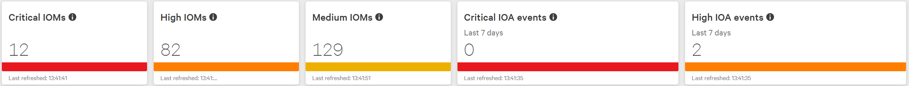

   * **Description**: Number of policies with severe misconfigurations + Number of critical attack indicators
   * **Use Case**: Focus on the most critical misconfigurations and risk events in your cloud environment. **`Critical IOMs`** indicate risk events that needs to be investigated and addressed immediately. **`High IOAs`** indicate risk events that require attention. 

3. Review **`Top 10 IOMs`**, **`Top 10 most detected behavior policies by severity`**

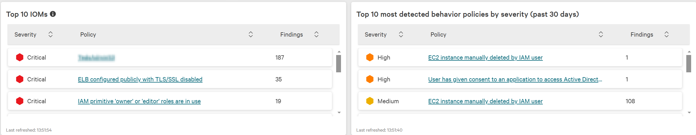

   * **Description**: Policies with the most misconfigured assets + Policies with the most attack indicators
   * **Use Case**: Focus on strengthening your processes and practices. Frequent misconfigurations reveal gaps in knowledge or processes that needs to be addressed at a wider level.

4. Review **`Top 10 accounts with configuration assessments`**, **`Configuration assessment by region`**, **`Top 10 users in behavior assessment`**

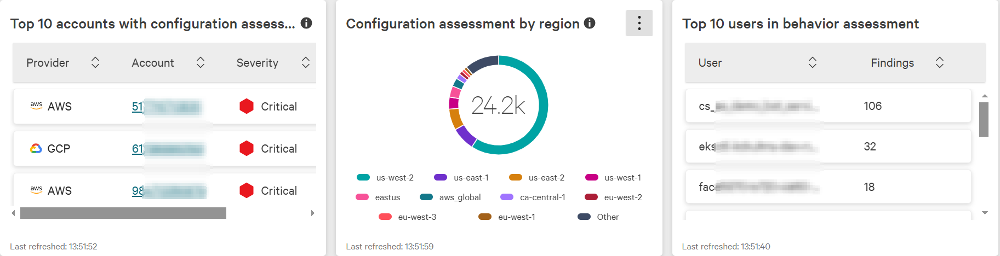

   * **Description**: Accounts with the most misconfigured assets
   * **Use Case**: Focus on teams, owners, or individuals that may need to tighthen their security practices

5. Review **`Top 10 IOA attack types`**

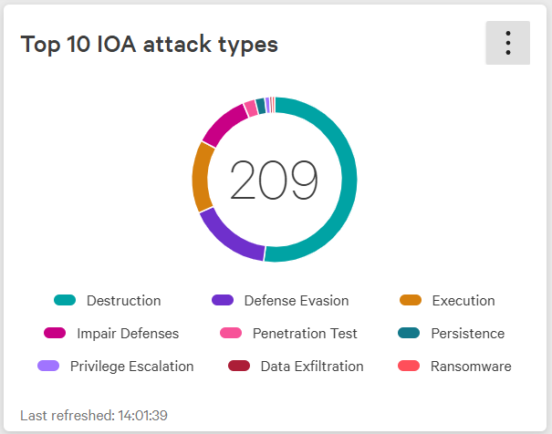

   * **Description**: Most common attack types
   * **Use Case**: Focus on hardening your defenses against the most prevalent attack types. Recurring attacks may indicate weaknesses in defenses that need a more robust security approach.

6. Review **`Assets with IOMs`**

   * **Description**: Number of assets with critical, high, and medium misconfigurations.
   * **Use Case**: Assess and address environment-wide misconfigurations. A large number of assets with high or critical issues suggests a need for enhanced configuration standards and regular audits across these assets.

7. Review **`Most recent IOA events`**

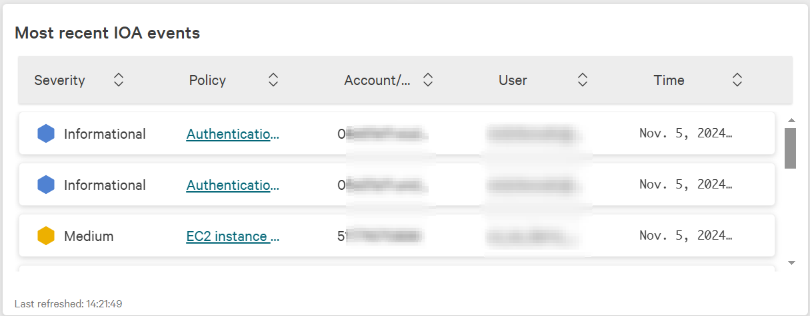

   * **Description**: Most current attack indicators
   * **Use Case**: Focus on most recent risk events in your environment. This is useful if you want to focus on mitigating evolving attack vectors very quickly.

8. Review **`AWS/Azure/GCP configuration assessment - trends by service`**

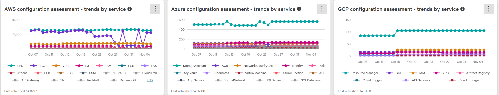

   * **Description**: Trends in misconfigurations by service
   * **Use Case**: Track improvement or decline over time. If your security practices are getting better, this should be reflected as a downward trend on these charts. An upward trend suggests your configuration practices are getting worse.
   

## Review your Cloud security coverage dashboard
1. Go to **`Falcon Console`** → **`Cloud security`** → **`Monitor`** → **`Activity`**.
   
2. Review **`Registered and unregistered cloud accounts`**

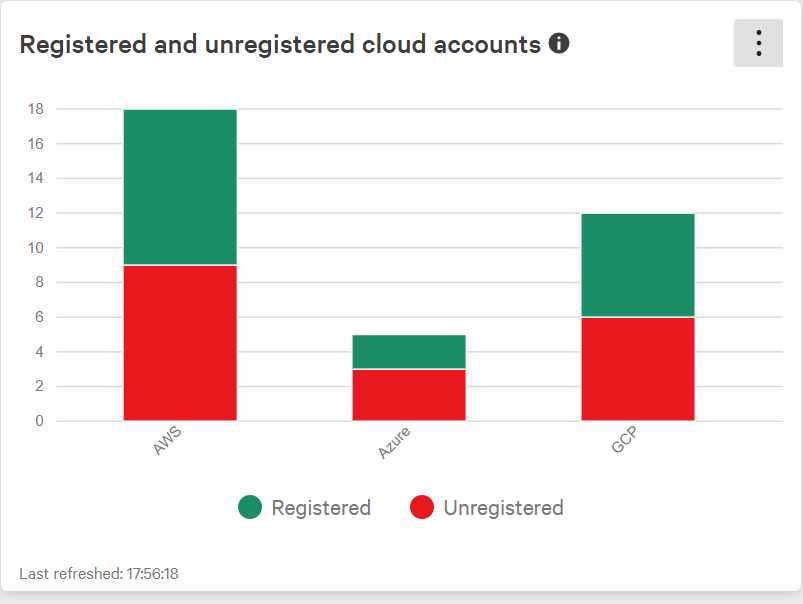

   * **Description**: Cloud accounts registered in CSPM. Unregistered accounts detected by sensors.
   * **Use Case**: Improve your cloud security coverage. Unregistered accounts indicate missing contextual data to help with prioritization, investigation, and response. 

3. Review **`Asset coverage`**

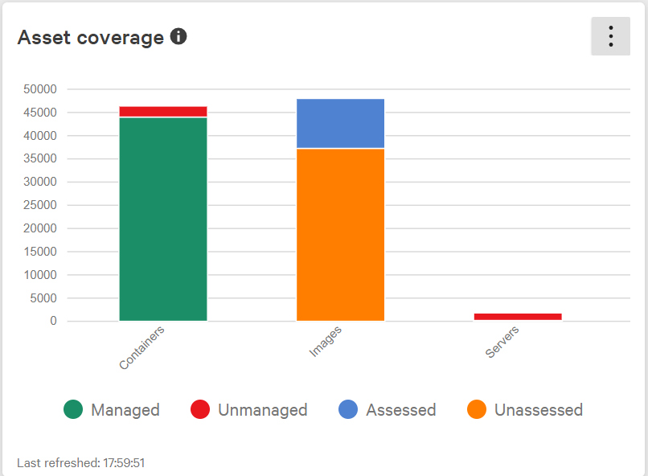

   * **Description**: Cloud accounts registered in CSPM. Unregistered accounts detected by sensors.
     * **`Unassessed images`**: Running images without IAR installed
     * **`Unmanaged containers`**: Containers that are running in environments that are not protected by the Falcon sensor. Usually identified by the Kubernetes visibility agent (KAC/KPA). Takes the list of identified containers and cross references it with the containers protected by the sensor.
     * **`Unmanaged servers`**: VMs that are NOT protected by the Falcon Sensor.
   * **Use Case**: Improve your cloud security coverage. **`Unmanaged containers and servers`** are at risk of being breched. **`Unassessed images`** means missing contextual information for prioritizing risk remediaion eforts accounts indicate missing contextual data to help with prioritization, investigation, and response. 

4. Review **`Unmanaged asset trend`**

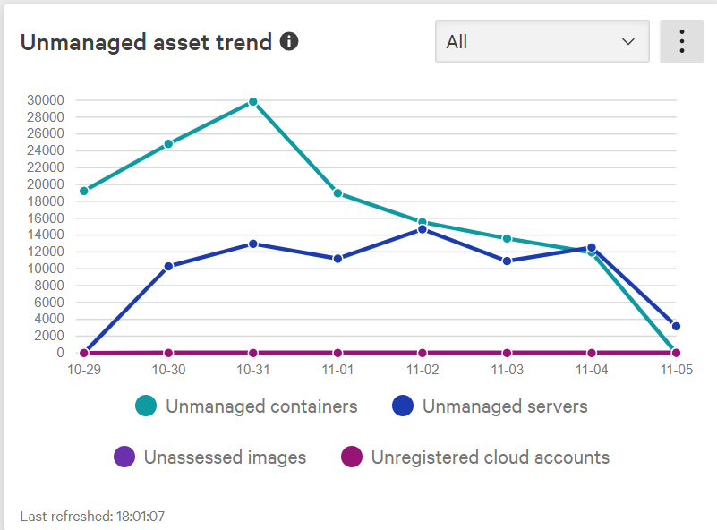

   * **Description**: Cloud accounts registered in CSPM. Unregistered accounts detected by sensors.
   * **Use Case**: Improve your cloud security coverage. Unregistered accounts indicate missing contextual data to help with prioritization, investigation, and response. 

## Review Cloud security compliance dashboard
1. Go to **`Falcon Console`** → **`Monitor`** → **`Activity`** → Scroll down **`Compliance`**.
   
2. Review **`Compliance checks by framework`**

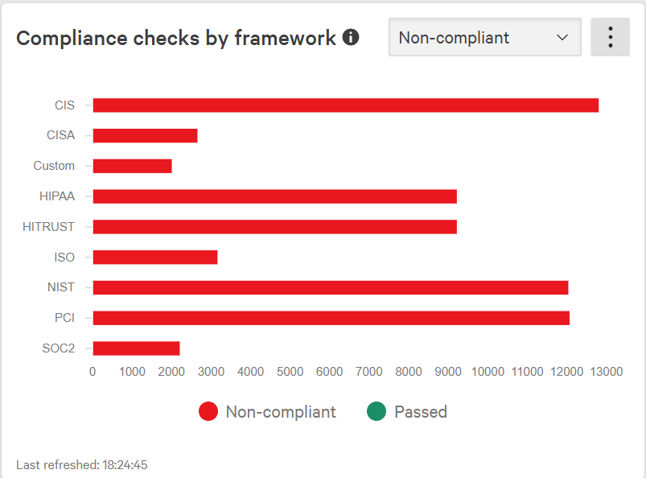

   * **Description**: Breakdown of compliance checks by security framework (e.g., CIS, NIST).
   * **Use Case**: Identify compliance gaps in your environment. 

3. Review **`Non-compliant assets trends`**

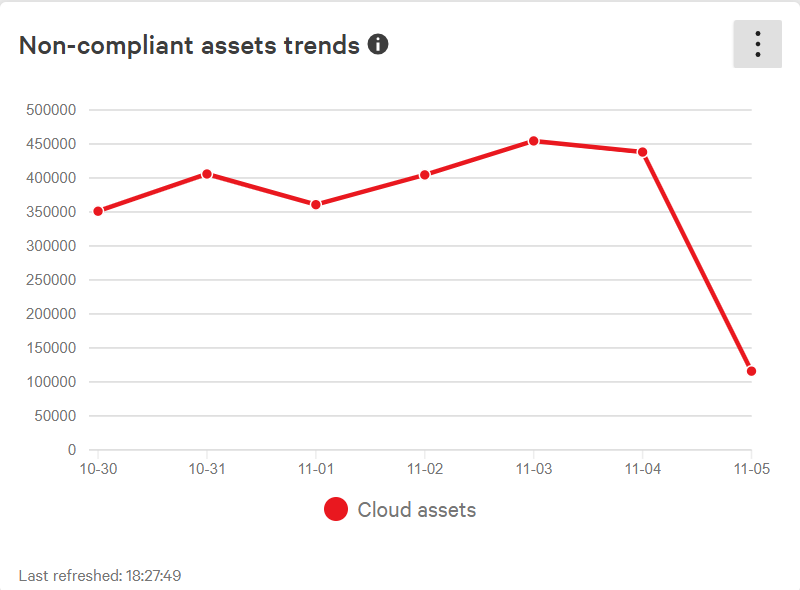

   * **Description**: Trend of non-compliant assets over time.
   * **Use Case**: Track the progress of compliance efforts. A downward trend indicates improved compliance across assets. 

## Review Cloud security health
1. Go to **`Falcon Console`** → **`Cloud security`** → **`Settings`** → **`Account registration`**.
   * Review each provider - **`AWS`**, **`Azure`**, **`GCP`**, **`Kubernetes`**.
   
2. Review **`Registered and unregistered cloud accounts`**

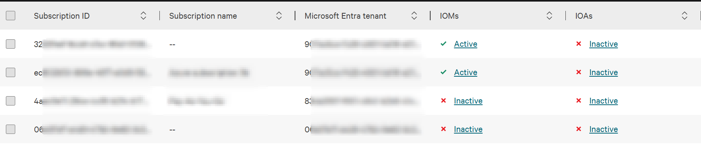

   * **Description**: Cloud accounts registered in CSPM. Unregistered accounts detected by sensors.
   * **Use Case**: Improve your cloud security coverage. Unregistered accounts indicate missing contextual data to help with prioritization, investigation, and response. 

3. Go to **`Falcon Console`** → **`Cloud security`** → **`Assets`** → **`Public cloud inventory`**  → **`Dashboard`**

4. Review **`Registered cloud accounts`**

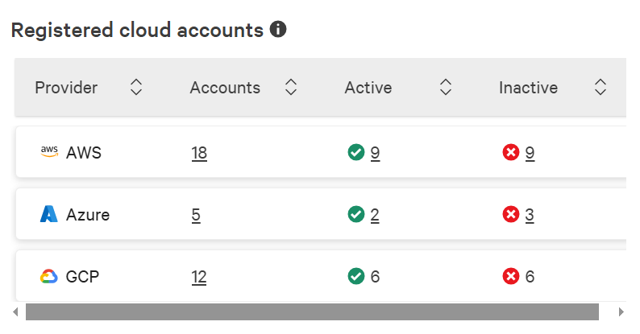

   * **Description**: Shows a total of registered cloud accounts and a breakdown of active and inactive accounts.
   * **Use Case**: Focus on improving your processes around improving security coverage and cleaning up stale data. 

5. Review **`Instances by sensor coverage`** and **`Instances by cloud provider`**
   * **`Falcon Console`** → **`Cloud security`** → **`Assets`** → **`Public cloud inventory`**  → **`Cloud assets`**
    * **Filter** → **Managed by:** → **`Unmanaged`** OR **`Sensor`** OR **`Snapshot`**

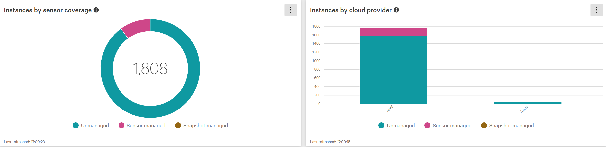

   * **Description**: Shows a total of registered cloud accounts and a breakdown of active and inactive accounts.
   * **Use Case**: Efforts to reduce security blind spots and improve security coverage. Focus on improving sensor coverage across all cloud providers.

## Response - Fusion SOAR

1. **Create a Fusion SOAR integration**
   * Go to **`Falcon Console`** → **`Next-Gen SIEM`** → **`Fusion SOAR`** → **`Integrations`**.
    * **`JIRA`** ; **`Falcon Fusion for Microsoft Teams`** ; **`PagerDuty`** ; **`Response Actions built for Microsoft Entra ID`** ; **`Okta Response Actions`** ; **`Slack`** ; **`Splunk`** ; **`Webhook`**

2. **Create a Fusion SOAR playbook**
   * Go to **`Falcon Console`** → **`Next-Gen SIEM`** → **`Fusion SOAR`** → **`Playbooks`**.

3. **Create a new cloud security workflow**
   * In the Create workflow window, configure the following:
   * **What will trigger the workflow?**: Event
   * Next
   * **Trigger category**: **`Cloud Security assessment`**
     * **Subcategory**: **`Configuration (IOM) configuration`** OR **`Behavior (IOA)`**
   
4. **Create a new container security workflow**
   * In the Create workflow window, configure the following:
   * **What will trigger the workflow?**: Event
   * Next
   * **Trigger category**: **`Kubernetes and containers`**
     * **Subcategory**: **`Image assessment`** OR **`Container detection`** OR **`Registry assessment`** OR **`Prevention policy`**

## Multi-cloud support in Falcon Cloud Security

|  | **IOM** | **IOA** | **1-Click Remediation** | **Agentless Scanning** | **Identity Protection** | **ASPM** | **DSPM** |
|---|---|---|---|---|---|---|---|
| **AWS** | Yes | Yes | Yes | Yes | Yes | Yes | Yes |
| **Azure** | Yes | Yes | No? | No | Yes | Yes | No |
| **GCP** | Yes | No | No | No | Yes | Yes | No |

Extend threat-detection capabilities to IAM Identity Center. Requires active subscription to Falcon Identity Protection. 
Identity protection requires you to enable threat detection for this AWS account. Threat detection leverages AWS CloudTrail with Falcon Cloud Security (FCS) to ensure the continuous monitoring of your end-to-end environment. In addition to identity protection, proceeding here will also enable:

Behavior assessment (IOAs) Near real-time detection of suspicious activities occurring in your cloud environment. For details, see Monitor suspicious behavior.

## Other FAQ
* **What happens when an Azure subscription is removed from the Falcon Cloud Security console?**
  * The subscription is removed from the Falcon Cloud Security console. 
  * All associated **`assets`** will be removed from the inventory.
  * **`Misconfigurations`** (IOMs), and **`Detections`** (IOAs) would be retained for 30 days??
    * Cloud Security → Cloud Posture → Indicators of Misconfigurations (IOMs)
    * Cloud Security → Cloud Posture → Cloud Indicators of Attack (IOAs)

* **Would happens if a cloud asset is deleted in the cloud account?**
  * The asset would be removed from the Falcon Cloud Security asset inventory if it is not found during the next scan.
  * Detections would be retained for 30 days. You could also see those historical ones in Logscale.