---
Title: 2b - Enable IOA for the Entra ID Tenant and Azure Subscriptions
Description: Follow these instructions to provision your Azure tenant and subscriptions for Indicator of Attack (IOA) detection
Author: David Okeyode
---
# Module 2b - Enable IOA for the Entra ID Tenant and Azure Subscriptions

## Pre-Requisites
1. A CrowdStrike API client ID and client secret

## Exercise 1 - Enable IOA for the Entra ID Tenant

1. **`Falcon Console`** → **`Cloud security`** → **`Settings`** → **`Account registration`** → **`Azure`** → Click on inactive in the IOA for the subscription column

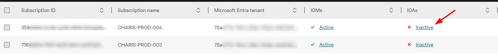

3. **Select the default subscription to create resources in**
* In the **`Indicators of attack (IOAs)`** window, click on the **`edit`** icon next to **`Default subscription`** → Select the subscription that you want to create IOA resources in → Save.

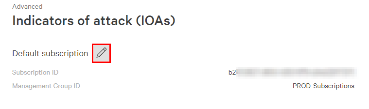

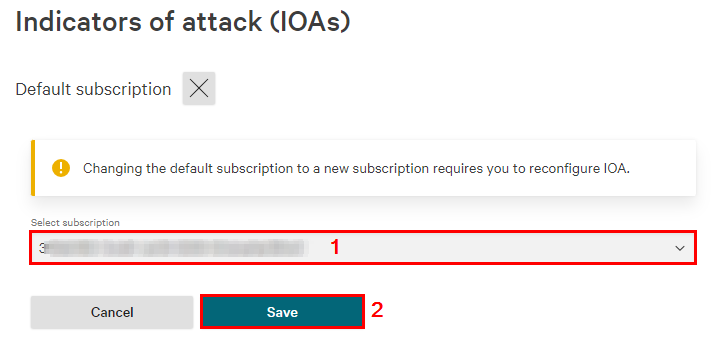

4. **In the **`Indicators of attack (IOAs)`** window, click on the **`edit`** icon next to **`Microosoft Entra ID`**** 

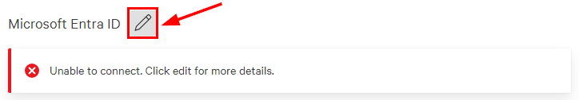

5. **Enter your **`CrowdStrike API client ID`** and **`client secret`**, click on **`Submit`**, then click on **`Download Script`**. This will download a Bash shell script - **`horizon_azure_registration_ioa_aad.sh`** to your PC**.

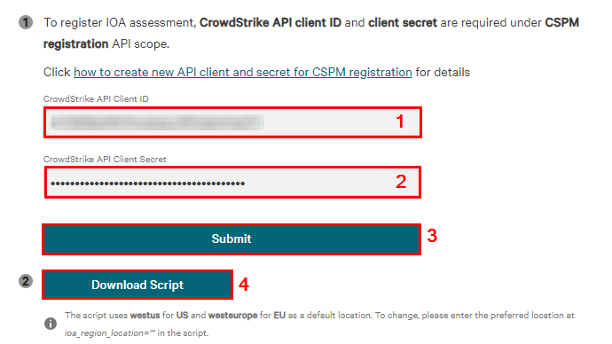

6. **Login to Azure Cloud Shell in bash mode and upload the downloaded script - **`horizon_azure_registration_ioa_aad.sh`** to it.**
* **`https://shell.azure.com`** → Authenticate if prompted → Manage files → Upload → Upload the script. 

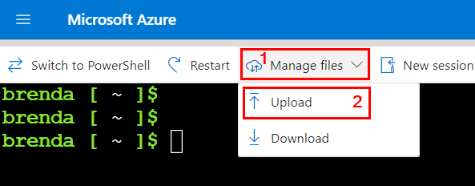

7. **OPTIONAL - Modify the script if needed.**
* The script selects the location to deploy the resources into based on your CrowdStrike tenant location.
  * It uses **`westus`** for **`US`** and **`westeurope`** for **`EU`**.
  * You can modify the variable **`ioa_region_location=""`** in the script to change this default behaviour.

8. **Run the following commands to execute the script:**
```
chmod +x horizon_azure_registration_ioa_aad.sh 

./horizon_azure_registration_ioa_aad.sh
```

9. **Wait for the script to complete. It can take up to 40 minutes to complete.**

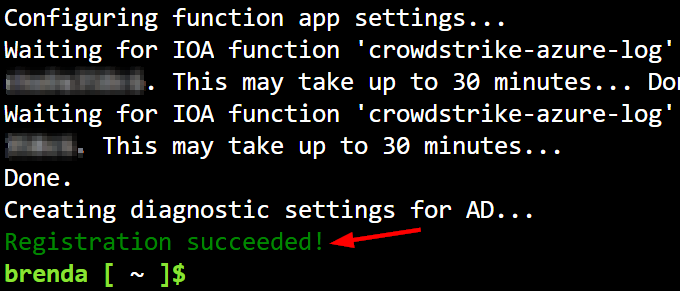

10. **Once the script ran successfully, go back to the Falcon Console and click **`Validate`**. You should receive a message about a successful validation.**

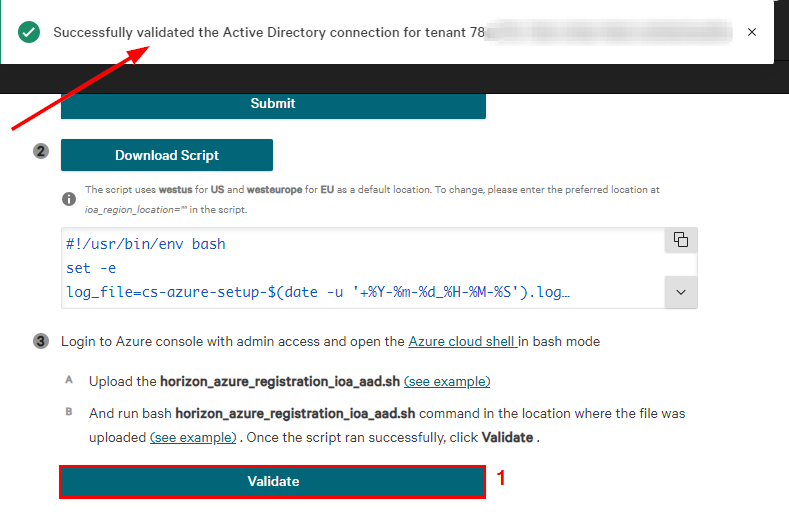


### What resources were created by the tenant IOA onboarding script?
1. **Virtual Network**
* cs-vnet - 10.0.0.0/16
  * cs-subnet-1 - 10.0.0.0/24
  * cs-subnet-2 - 10.0.1.0/24
  * cs-subnet-3 - 10.0.2.0/24
    * For private endpoints
      * activity-storage
      * aad-storage
      * log-storage
      * keyvault

2. **Event Hub Namespace with two Event Hubs**
* cs-eventhub-monitor-aad-logs (8 partitions)
* cs-eventhub-monitor-activity-logs (8 partitions)

3. **`KeyVault`**
* Service endpoint to only allow access from cs-subnet-1 and cs-subnet-2

4. **Three Storage Accounts**
* **`Entra ID Logs Storage Account`**
* **`Activity Logs Storage Account`**
* **`Key Vault Diagnostic Logs Storage Account`**

* **Settings**
    * Locally Redundant Storage (LRS)
    * Soft delete with one day retention

5. **Two Function Apps**
**a. Activity Logs Function App**
* **`Standard S1 - 0.077 GBP/hour (56.339 GBP/month)`**
    * 1.75GB per instance
    * Default number = 2
    * Maximum scale = 10
    * Scale out = Rule Based ()
* Downloads code from CrowdStrike
* **`Runs two functions`**
    * **`Event Hub Trigger`** - 
        * Handles the processing of events received from Azure Event Hub. It sends events in batches using a gRPC stream.
    * **`Timer Trigger`** - 
        * Writes a heartbeat event (timestamp) of the last time the function successfully ran and stores it in the **`heartbeat`** container of the Activity log storage account. The heartbeat event is used to prevent multiple overlapping function invocations.
* **`System assigned managed identity`**
    * Has permission to read logs from the Event Hub (Azure Event Hubs Data Receiver)
    * Has permission to write data to the activity log storage account (Storage Blob Data Owner)
    * Has permission to read secrets from the Key Vault (Key Vault Secrets Officer)
* **`Has virtual network integration`** of **`cs-vnet/cs-subnet-1`**
    * Public network access blocked

**b. Entra ID Logs Function App**
* **`Standard S1 - 0.077 GBP/hour (56.339 GBP/month)`**
    * 1.75GB per instance
    * Default number = 1
    * Maximum scale = 10
    * Scale out = Rule Based
* **`Runs two functions`**
    * **`Event Hub Trigger`**
        * Handles the processing of events received from Azure Event Hub. It sends events in batches using a gRPC stream.
    * **`Timer Trigger`**
        * Tracks successful executions (heartbeats) using Azure Blob Storage. It stores the timestamp of the last successful run in a blob container.
* **`System assigned managed identity`**
    * Has permission to read logs from the Event Hub (Azure Event Hubs Data Receiver)
    * Has permission to write data to the activity log storage account (Storage Blob Data Owner)
    * Has permission to read secrets from the Key Vault (Key Vault Secrets Officer)
* **`Has virtual network integration`** of **`cs-vnet/cs-subnet-1`**
    * Public network access blocked


### Exercise 2 - Enable IOA for the Azure Subscriptions

1. **In the Falcon console, scroll down and click on **`Activate Subscriptions`**.**

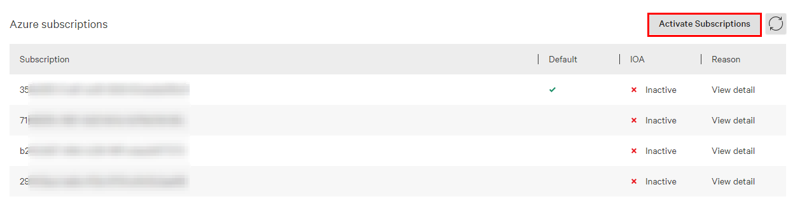

2. **In the Activate Subscriptions window, click on **`Download Script`**. This will download a Bash shell script - **`horizon_azure_registration_ioa_subscription.sh`** to your PC.**

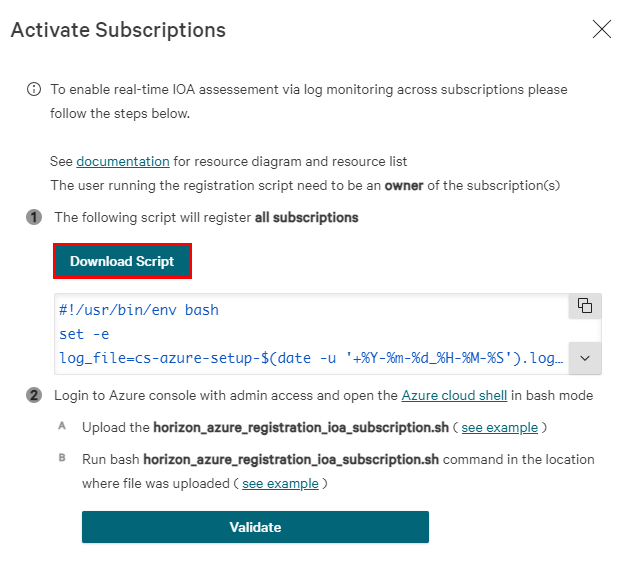

3. **Login to Azure Cloud Shell in bash mode and upload the downloaded script - **`horizon_azure_registration_ioa_subscription.sh`** to it.**
* **`https://shell.azure.com`** → Authenticate if prompted → Manage files → Upload → Upload the script. 


4. **OPTIONAL - Modify the script if needed.**
* By default, the script configures a diagnostic setting for every onboarded subscription to send the activity logs to the Event Hub that was created by the tennant onboarding script.

5. **Run the following commands to execute the script:**
```
chmod +x horizon_azure_registration_ioa_subscription.sh 

./horizon_azure_registration_ioa_subscription.sh
```

6. **Wait for the script to complete. It only takes a few minutes to complete.**

7. **Once the script ran successfully, go back to the Falcon Console and click **`Validate`**. You should receive a message about a successful validation.**

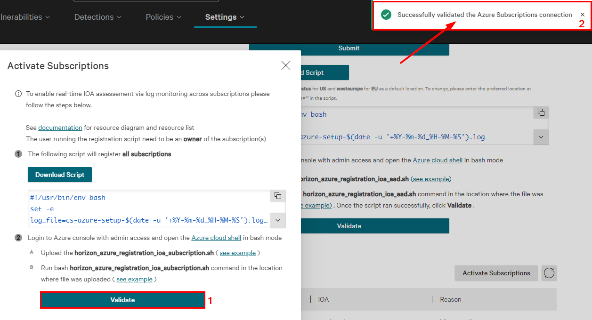

### What resources were created by the tenant IOA onboarding script?
1. **Diagnostic Settings**
* To stream activity logs for all subscriptions into the activity log Event Hub.
    * Azure Monitor → Activity Log → Export Activity Log → cs-monitor-activity-to-eventhub

