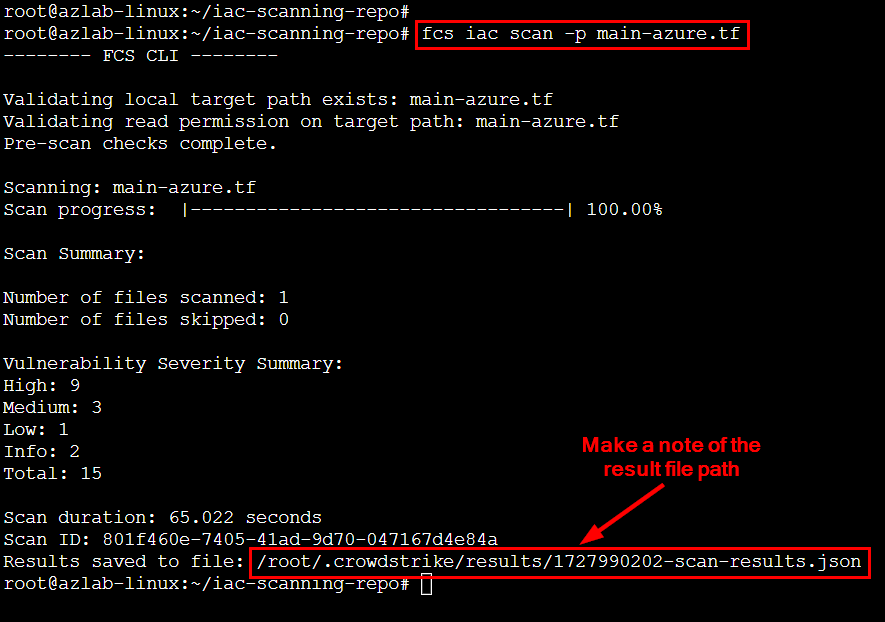

## Module 5 - Introduction - Scan Azure IaC Templates
CrowdStrike Falcon has capabilities to scan Azure and other IaC templates to detect misconfigurations and vulnerabilities before deployment. Here are the exercises that we will complete:

> * Scan Azure IaC Templates
> * Review IaC Scan Results

**The following template formats are supported**: 
> * **Cloud Infrastructure**: **`Azure Resource Manager (ARM)`**; **`CloudFormation (CDK, SAM)`**; **`Google Deployment Manager`**; **`Terraform`**; **`Ansible`**; **`Pulumi (YAML)`**; **`Crossplane`**
> * **Container IaC**: **`Dockerfile`**; **`Docker Compose`**; **`Kubernetes (Helm)`**; **`Buildah`**; **`Knative`**
> * **API**: **`OpenAPI`**
> * **Serverless Application Management**: **`ServerlessFW`**

## Exercise 1 - Scan Azure IaC Templates
1. **Create a directory and download templates and scripts into it**.
```
mkdir iac-scanning-repo
cd iac-scanning-repo

curl -o main-azure.tf https://raw.githubusercontent.com/davidokeyode/crowdstrike-workshop-labs/refs/heads/main/workshops/azure-cloud-protection/templates/iac-scanning-repo/main-azure.tf

curl -o setup.sh https://raw.githubusercontent.com/davidokeyode/crowdstrike-workshop-labs/refs/heads/main/workshops/azure-cloud-protection/templates/iac-scanning-repo/setup.sh
```

2. **Install the CrowdStrike IaC Scanning tool**.
```
chmod +x setup.sh
./setup.sh
```

3. **Review the IaC template** - **`main.tf`**
* Deploys a Storage Account, Virtual Network, Virtual Machine, Managed Identity and a Network Security Group (NSG).
```
cat main-azure.tf
```

4. **Scan the template for misconfigurations**
* **`Make a note of the result`**
```
fcs help
fcs iac scan -p main-azure.tf
```




## Exercise 2 - Review IaC Scan Results
1. **List Violations by Severity**.
```
jq '.policy_detections[] | select(.severity == "HIGH") | {policy_name: .policy_name, resource_name: .detections[].resource_name, line: .detections[].line}' <RESULT_PATH_FILE>
```

2. **Count Violations by Severity**.
```
jq '.policy_detections[] | {policy_name: .policy_name, severity: .severity, line: .detections[].line}' /root/.crowdstrike/results/1727967528-scan-results.json

jq '.detection_summary' /root/.crowdstrike/results/1727967528-scan-results.json
```

3. **List Policy Violations by Category**
```
jq '.policy_detections[] | {category: .policy_category, policy_name: .policy_name, resource_name: .detections[].resource_name, line: .detections[].line}' /root/.crowdstrike/results/1727967528-scan-results.json
```
