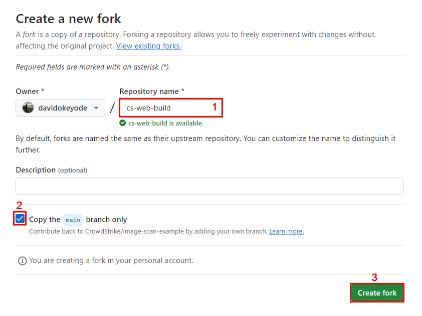
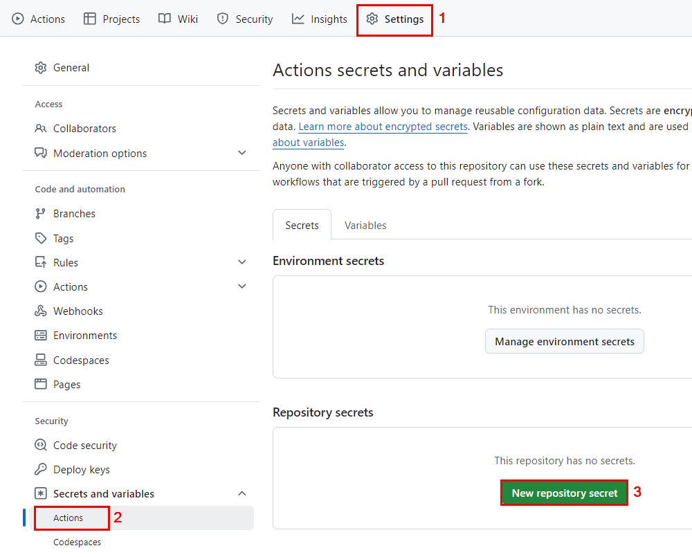
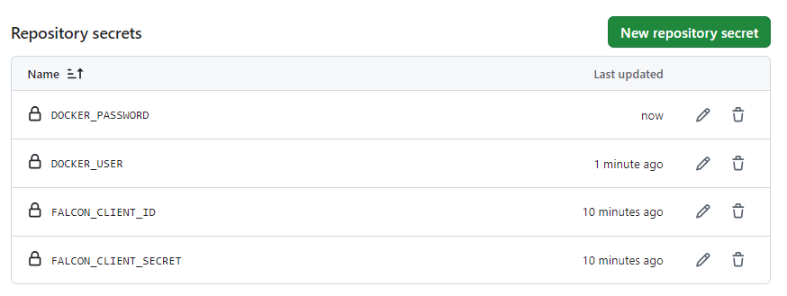
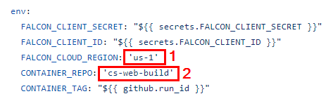
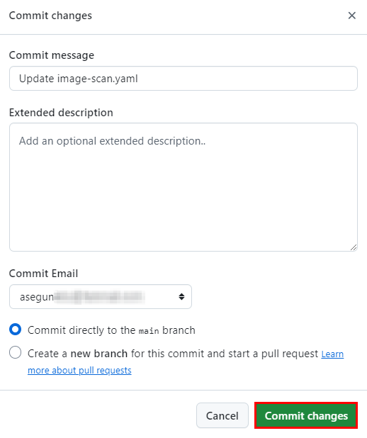

> * Create an API client key pair
> * Log into the Docker registry
> * Push images for assessment
> * Fetch image assessment reports

## APPROACH 1 - Push the image that you want to scan into the CrowdStrike container registry
> * Add the source IP address to IP Allowlist Management
  * Falcon Console → Host setup and management → Falcon users → IP Allowlist Management

> * Supported image format: Docker Image Manifest Version 2, Schema 2

> * Supported image size: Image layers have a maximum size of 10GB. There is no limit on total image size.


### 1 - Create an API client key pair
* **`Falcon console`** → **`Support and resources`** → **`Resources and tools`** → **`API clients and keys`** → **`Create an API client`**
  * **Falcon Container Image**: **`Read`** and **`Write`**


### 2 - Log into the Docker registry
* Using the API client key pair

```
$FALCON_CLIENT_ID="YOUR_FALCON_API_CLIENT_ID"
$FALCON_CLIENT_SECRET="YOUR_FALCON_API_CLIENT_SECRET"
$CLOUD="us-1.crowdstrike.com"

docker login --username $FALCON_CLIENT_ID --password $FALCON_CLIENT_SECRET container-upload.$CLOUD
```

* **APIs and Cloud Endpoints**
* API_BASE_URL=https://api.crowdstrike.com
  * YOUR_CLOUD=us-1.crowdstrike.com

* API_BASE_URL=https://api.us-2.crowdstrike.com
  * YOUR_CLOUD=us-2.crowdstrike.com

* API_BASE_URL=https://api.eu-1.crowdstrike.com
  * YOUR_CLOUD=eu-1.crowdstrike.com


### 3a - Push images for assessment using Docker
* After pushing the image, CrowdStrike begins an immediate assessment. 
* When your build is assessed, CrowdStrike looks at every binary in your image. 
    * Detects installed packages and scans them for vulnerabiliies (CVEs)
    * Detects Linux binary and scans them for malware (Malware)
    * Detects secrets and misconfigurations in every part of a container image (Secret and misconfiguration)

```
$CLOUD="us-1.crowdstrike.com"
$REPO="nginx"
$TAG="1.13.6"
$PUSHTAG="pushtag001"

docker tag ${REPO}:${TAG} container-upload.${CLOUD}/${REPO}:${PUSHTAG}

docker push container-upload.${CLOUD}/${REPO}:${PUSHTAG}
```

### 3b - Push images for assessment using Skopeo
* Docker push does not preserve the image digest.
* Falcon console will correlate assessed images to running images by using the image ID and not the image digest.
* To preserve the image digests, we can use Skopeo to copy images from our image registry to CrowdStrike's image registry.
* **Skopeo Reference**: https://github.com/containers/skopeo/tree/main

```
$FALCON_CLIENT_ID="YOUR_FALCON_API_CLIENT_ID"
$FALCON_CLIENT_SECRET="YOUR_FALCON_API_CLIENT_SECRET"
$CLOUD="us-1.crowdstrike.com"
$REPO="nginx"
$TAG="1.13.6"
$PUSHTAG="pushtag001"

skopeo copy --preserve-digests --override-arch amd64 --override-os linux docker://docker.io/${REPO}:${TAG} docker://container-upload.${YOUR_CLOUD)/${REPO}:${PUSHTAG} --dest-creds="${FALCON_CLIENT_ID}:${FALCON_CLIENT_SECRET}"
```

### 4 - Fetch image assessment reports
* **WINDOWS POWERSHELL**
```
$FALCON_CLIENT_ID="YOUR_FALCON_API_CLIENT_ID"
$FALCON_CLIENT_SECRET="YOUR_FALCON_API_CLIENT_SECRET"
$CLOUD="us-1.crowdstrike.com"
$API_BASE_URL="https://api.crowdstrike.com"
$REPO="nginx"
$TAG="pushtag001"

# Prepare the body for the POST request
$body = @{
    client_id = $FALCON_CLIENT_ID
    client_secret = $FALCON_CLIENT_SECRET
}

# Send the POST request to get the access token (without the -Silent parameter)
$response = Invoke-RestMethod -Uri "$API_BASE_URL/oauth2/token" -Method Post -ContentType "application/x-www-form-urlencoded" -Body $body

# Extract the access token
$CS_JWT = $response.access_token

# Step 2: Perform GET request with the token
# Send the GET request to retrieve the report using the repo and tag
$reportUrl = "https://container-upload.$CLOUD/reports?repository=$REPO&tag=$TAG"
$response = Invoke-RestMethod -Uri $reportUrl -Method Get -Headers @{ Authorization = "Bearer $CS_JWT" }


# Send the GET request to retrieve the report using the image ID and digest
$reportUrl = "https://container-upload.$CLOUD/reports?image_id=$IMAGE_ID&digest=$DIGEST"
Invoke-RestMethod -Uri $reportUrl -Method Get -Headers @{ Authorization = "Bearer $CS_JWT" }
```

* **LINUX**
```
$FALCON_CLIENT_ID="YOUR_FALCON_API_CLIENT_ID"
$FALCON_CLIENT_SECRET="YOUR_FALCON_API_CLIENT_SECRET"
$CLOUD="us-1.crowdstrike.com"
$API_BASE_URL="https://api.crowdstrike.com"
$REPO="nginx"
$TAG="pushtag001"

RESPONSE=$(curl --header "Content-Type: application/x-www-form-urlencoded" --data "client_id=${FALCON_CLIENT_ID}&client_secret=${FALCON_CLIENT_SECRET}" --request POST --silent ${API_BASE_URL}/oauth2/token) CS_JWT=$(echo ${RESPONSE} | jq -r '.access_token')

curl --header "Authorization: Bearer ${CS_JWT}" --request GET "https://container-upload.${CLOUD}/reports?repository=${REPO}&tag=${TAG}"

curl --header "Authorization: Bearer ${CS_JWT}" --request GET "https://container-upload.${CLOUD}/reports?image_id=${IMAGE_ID}&digest=${DIGEST}"
```


## APPROACH 2 - USING THE AUTOMATED OPTION (PYTHON SCRIPT)
* **REFERENCE**: https://github.com/CrowdStrike/container-image-scan

1. **Install pre-requisites**

* **LINUX**
```
apt install python3 -y
python3 --version

apt install python3-pip -y
pip3 --version

git --version

git clone https://github.com/CrowdStrike/container-image-scan
cd container-image-scan

pip3 install docker crowdstrike-falconpy
pip3 install -r requirements.txt
```

* **WINDOWS**
```
choco install python3 -y
python -V
pip3 -V

git --version

git clone https://github.com/CrowdStrike/container-image-scan
cd container-image-scan

pip3 install docker crowdstrike-falconpy
pip3 install -r requirements.txt
```

2. **Run a scan using the tool**
* **LINUX**
```
## Review help
python3 cs_scanimage.py --help

## Set variables
export FALCON_CLIENT_ID="YOUR_FALCON_API_CLIENT_ID"
export FALCON_CLIENT_SECRET="YOUR_FALCON_API_CLIENT_SECRET"
export CLOUD="us-1"
$REPO="nginx"
TAG="1.13.6"

## Download sample container
docker pull nginx:1.13.6

## Sample simple scan
python3 cs_scanimage.py --clientid $FALCON_CLIENT_ID --repo $REPO --tag $TAG --cloud-region $CLOUD

## Set a score threshold using "-s" OR "--score_threshold"
python3 cs_scanimage.py --clientid $FALCON_CLIENT_ID --repo $REPO --tag $TAG --cloud-region $CLOUD -s 1500

## Review the exit code
echo $?

## Export JSON report to specified file and set the logging level
** --log-level {DEBUG,INFO,WARNING,ERROR,CRITICAL}
python3 cs_scanimage.py --clientid $FALCON_CLIENT_ID --repo $REPO --tag $TAG --cloud-region $CLOUD -s 1500 --json-report scanreport.json --log-level CRITICAL

## Print the report as JSON to stdout
python3 cs_scanimage.py --clientid $FALCON_CLIENT_ID --repo $REPO --tag $TAG --cloud-region $CLOUD -s 1500 --plugin 
```

* **WINDOWS**
```
python cs_scanimage.py --help

$FALCON_CLIENT_ID="YOUR_FALCON_API_CLIENT_ID"
$FALCON_CLIENT_SECRET="YOUR_FALCON_API_CLIENT_SECRET"
$CLOUD="us-1"
$REPO="nginx"
$TAG="1.13.6"

python3 cs_scanimage.py --clientid $FALCON_CLIENT_ID --repo $REPO --tag $TAG --cloud-region $CLOUD
```


## APPROACH 3 - USING THE AUTOMATED OPTION (CONTAINER)
* **REFERENCE**: https://github.com/CrowdStrike/container-image-scan

1. **Run an assessment scan**

* **LINUX**
```
export FALCON_CLIENT_ID="YOUR_FALCON_API_CLIENT_ID"
export FALCON_CLIENT_SECRET="YOUR_FALCON_API_CLIENT_SECRET"
$CLOUD="us-1"
$REPO="nginx"
$TAG="1.13.6"

## Run a simple scan (we can use same parameters as above)
docker run -it --rm -e $FALCON_CLIENT_ID -e $FALCON_CLIENT_SECRET -v /var/run/docker.sock:/var/run/docker.sock quay.io/crowdstrike/container-image-scan:latest --repo $REPO --tag $TAG -c $CLOUD --clientid $FALCON_CLIENT_ID
```


## APPROACH 4 - USING THE GITHUB ACTION
* **REFERENCE**: 
  * https://github.com/marketplace/actions/crowdstrike-container-image-scan
  * https://github.com/marketplace/actions/crowdstrike-container-image-scan

* **CICD Examples (GitHub Actions/Azure DevOps/Jenkins/AWS CodeCommit)**
  * https://github.com/CrowdStrike/image-scan-example


## APPROACH 4a - USING THE GITHUB ACTION FROM THE MARKETPLACE
* **REFERENCE**: 
  * https://github.com/marketplace/actions/crowdstrike-container-image-scan

* **CICD Examples (GitHub Actions/Azure DevOps/Jenkins/AWS CodeCommit)**
  * https://github.com/CrowdStrike/image-scan-example

1. **Pre-Requisites**
* **`Falcon Cloud Security for Containers`** OR **`Falcon for Managed Containers`** subscription. Refer to this document: https://www.crowdstrike.com/wp-content/uploads/2024/10/Falcon_Cloud_Security_data_sheet.pdf
* Create an OAUTH2 secret at **`https://falcon.crowdstrike.com/support/api-clients-and-keys`**

2. **Create a Fork of this repository - `https://github.com/CrowdStrike/image-scan-example/fork`**
* **Repository name**: cs-web-build
* Create fork



3. **Enable GitHub Actions**
* Click on **`Actions`**.

4. **Add your CrowdStrike Falcon API key information as GitHub Secrets**
* Repository → Settings → Security → Secrets and variables → Actions → Secrets → Repository secrets → New repository secret



* **Configure the following secrets**:
  * **Name**: FALCON_CLIENT_ID
    * **Secret**: YOUR_FALCON_API_CLIENT_ID
  * **Name**: FALCON_CLIENT_SECRET
    * **Secret**: YOUR_FALCON_API_CLIENT_SECRET
  * **Name**: DOCKER_USER
    * **Secret**: YOUR_DOCKER_USERNAME
  * **Name**: DOCKER_PASSWORD
    * **Secret**: YOUR_DOCKER_PASSWORD



5. **Update the workflow file**
* **`.github/workflows`** → **`image-scan.yaml`** → **`Edit`** -> Modify the following in the **`env`** section:
  * **FALCON_CLOUD_REGION**: 'us-1' (or the region of your CrowdStrike Falcon tenant)
  * **CONTAINER_REPO**: 'cs-web-build'
  * You can also uncomment the **`crowdstrike_score`** on **`Line 46`** and set a score threshold to allow for step success.



* **Commit changes** -> **Commit changes**



6. Review the GitHub Action
* Click on **`Actions`**.


## IVAN TOOL

1. **Download the `IVAN` tool**
* **`Falcon Console`** → **`Support and resources`** → **`Resources and tools`** → **`Tool downloads`** → **`Falcon CWPP Image Vulnerability Analysis for Windows X64`** → **`Download`**

2. **Extract the compressed file and run `ivan.exe`**


## APPROACH 2 - USING THE AUTOMATED SCRIPT
1. **Download the `IVAN` tool**
* **`Falcon Console`** → **`Support and resources`** → **`Resources and tools`** → **`Tool downloads`** → **`Falcon CWPP Image Vulnerability Analysis for Windows X64`** → **`Download`**

2. **Extract the compressed file and run `ivan.exe`**


