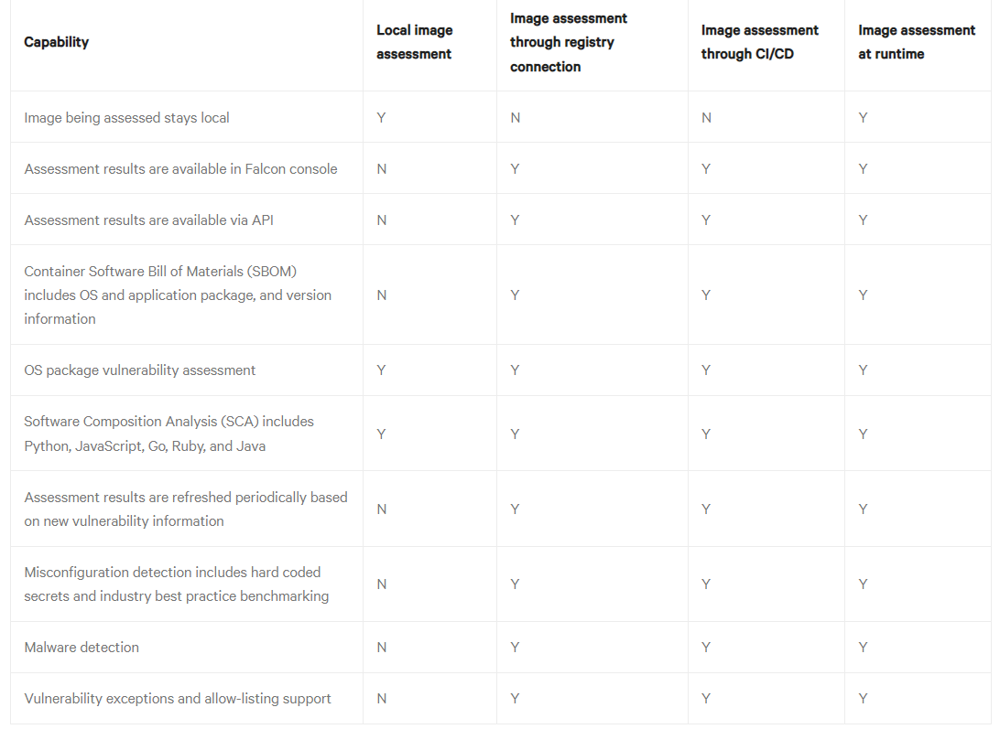
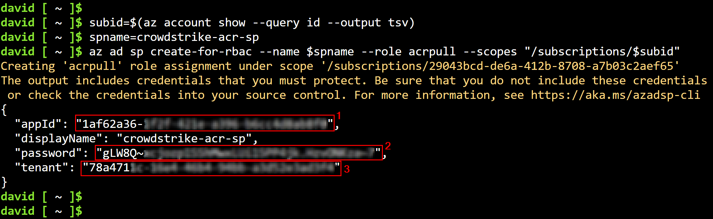
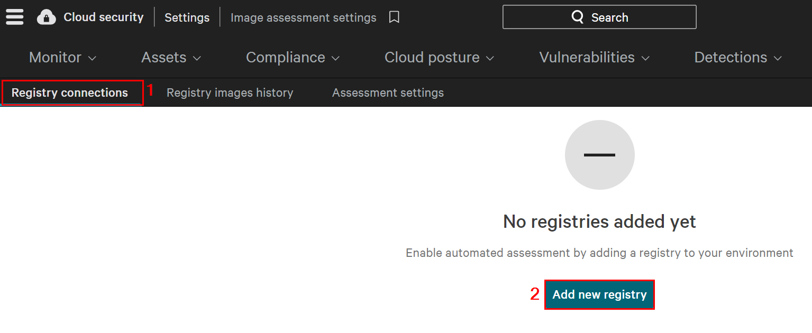
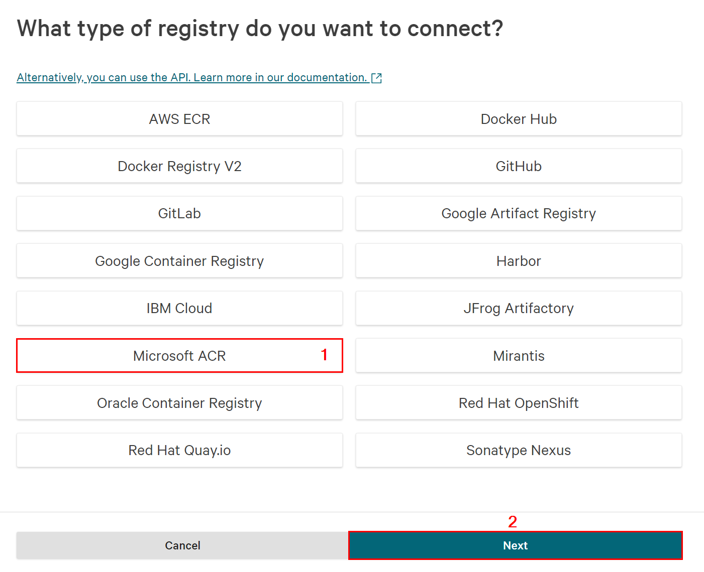
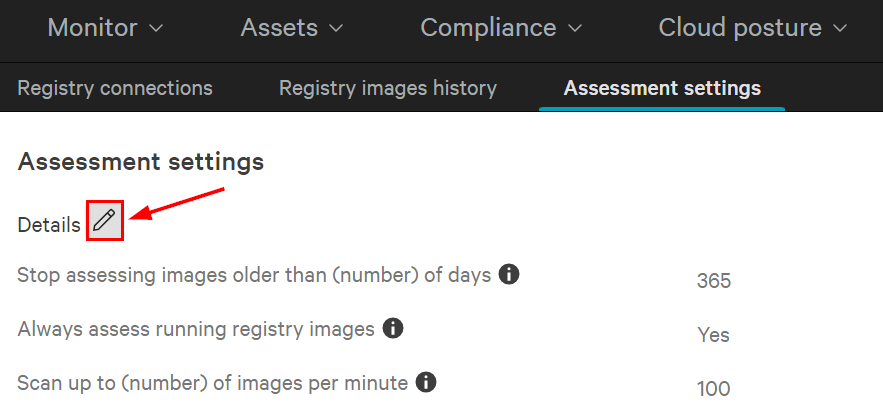
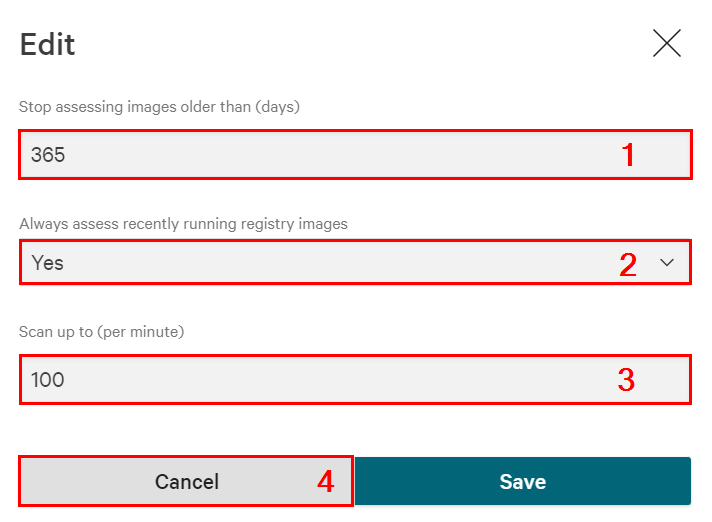
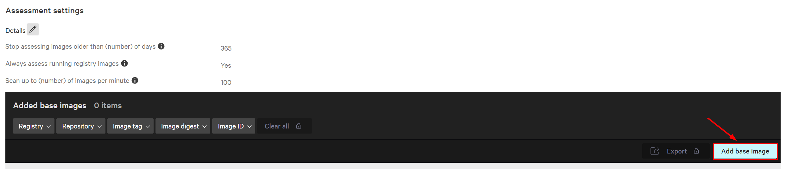

## Module 9 - Introduction - Protect ACR Images
CrowdStrike Falcon can scan Linux container images in Azure Container Registries (ACR) for OS and application package vulnerability, exposed secrets, malware and license compliance. CrowdStrike Falcon can scan images in both private and public ACR instances.

> * **Supported image formats**:
  * **`Docker image manifest version 2, schema version 2`**: `media type: application/vnd.docker.distribution.manifest.v2+json`
  * **`OCI image manifest`**: `media type: application/vnd.oci.image.manifest.v1+json`

### Image assessment option
* CrowdStrike Falcon supports FOUR image assessment options. The table below compares the four options:



## Module 9 - Exercises
In this module, we will begin to walk through some of the protection capabilities that CrowdStrike Falcon supports for container registries in Azure. We will use the same credential that we configured in module 6 to implement this. Here are the exercises that we will complete:

> * Import container images into the registry
> * Create a service principal (with secret) and grant it permissions to pull images from the registry
> * Create a CrowdStrike Falcon registry connection (with a service principal and key)
> * Troubleshooting ACR Integration

## Pre-Requisites
> * Module 1 has been completed

## Exercise 1: Import the CrowdStrike detection container image and other images into the registry
1. Open a web browser and go to **`https://shell.azure.com`**. If prompted, authenticate using your Azure admin credentials.

2. Run the commands below to create a service principal and assign the **`acrpull`** role to it on the subscription scope.
    * Replace **`[ACR_NAME]`** with the value of the **`acr Name`** in the output from **`Module 1`**
```
acrname="[ACR_NAME]"
az acr import --name $acrname --source quay.io/crowdstrike/detection-container
az acr import --name $acrname --source docker.io/sasanlabs/owasp-vulnerableapp:1.12.7
az acr import --name $acrname --source docker.io/library/nginx:1.13.6 --image nginx:1.13.6
az acr import --name $acrname --source docker.io/library/alpine:3.9.4 --image alpine:3.9.4
```

3. List repositories in the registry
```
az acr repository list --name $acrname --output table
```

## Exercise 2: Create a service principal (with secret) and grant it permissions to pull images from the registry

1. Open a web browser and go to **`https://shell.azure.com`**. If prompted, authenticate using your Azure admin credentials.

2. Run the commands below to create a service principal and assign the **`acrpull`** role to it on the subscription scope.
```
subid=$(az account show --query id --output tsv)
spname=crowdstrike-acr-sp
az ad sp create-for-rbac --name $spname --role acrpull --scopes "/subscriptions/$subid"
```

3. In the output of the above commands, make a note of the following values: **`appId`**, **`password`** and **`tenant`**. You will need these values in upcoming tasks.




## Exercise 3: Create a CrowdStrike Falcon registry connection (with a service principal and key)

1. Open the CrowdStrike Falcon console and go to **`Cloud security`** → **`Settings`** → **`Image Assessment settings`** → **`Registry connections`** → **`Add new registry`**



2. On the **`What type of registry do you want to connect?`** page, select **`Microsoft ACR`** then click **`Next`**.



3. On the **`Microsoft ACR connection`** page, configure the following:
* **Registry name (optional)**: Enter the value of the **`acr Name`** in the output from **`Module 1`**
* **Registry URL**: https://[ACR_NAME].azurecr.io/
    * Replace **`[ACR_NAME]`** with the value of the **`acr Name`** in the output from **`Module 1`**
* **Authenticate using**: Select **`Registry username and password`**
    * **Registry username**: Enter the value of the **`appId`** that you made a note of earlier
    * **Registry password**: Enter the value of the **`password`** that you made a note of earlier
* **Repository settings**: Select **`Monitor all repositories`**
* Click on **`Connect Registry`**.

> * Once connected, CrowdStrike Falcon pulls images from the protected repositories, expands the image layers, creates a Software Bill of Materials (SBOM) inventory, and scans the inventory
> * Images are stored in Amazon S3 buckets with server-side encryption enabled. 
> * Image layers are deleted after 24 hours, and only image metadata is kept long term.
> * Registries are checked for new images, and new/updated image layers every 2 hours (registry connections only).
> * Checks previous assessment report against new or updated detection and vulnerability info every 24 hours

## Exercise 4: Configure registry assessment settings

1. Open the CrowdStrike Falcon console and go to **`Cloud security`** → **`Settings`** → **`Image Assessment settings`** → **`Assessment settings`**. Click on the option to edit the settings.



2. In the **`Edit`** window, review the following settings, then click **`Cancel`**:
* **Stop assessing older images**: By default, images that have been in the registry for more than 365 days (from when they were first seen) won't be scanned. You can change this number if needed.
* **Always assess recently running images**: If you select this option, even images that have passed their retention period will continue to be scanned while they're running, plus for 7 extra days after they stop.
* **Scan speed**: The default scan speed is 100 images per minute per registry, but you can adjust it to between 1 and 100. If the image scans are using too much bandwidth or putting too much load on your registry, you can reduce the scan rate.




## Exercise 5: Configure base images
* Base images contain the necessary file system, libraries, and programs needed to run an application. Using the same base image for multiple container images helps maintain consistency, ensures portability, and improves security by limiting potential vulnerabilities to just one shared base image.

* In the Falcon console, you can specify which images are used as base images. This helps the console identify and remove duplicate information when vulnerabilities are found in base images used across different containers. By setting base images in the console, you can easily track and fix vulnerabilities in these base images more efficiently.

1. Open the CrowdStrike Falcon console and go to **`Cloud security`** → **`Settings`** → **`Image Assessment settings`** → **`Assessment settings`** → **`Add base image`**.



2. Back on the **`Assessment settings`** page, click on **`Add Base Image`**